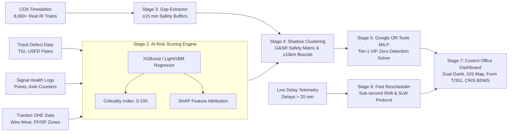

# 🚆 RailBlock — AI-Powered Automatic Block Planning System
### Smart India Hackathon 2026 | Problem Statement 26027
**Organization:** Ministry of Railways (CRIS / RDSO)  
**Theme:** Transportation & Logistics | **Category:** Software  

---

## 📌 Executive Summary

Railway infrastructure maintenance across Indian Railways operates across three distinct engineering divisions:
* **Civil Engineering (Tracks & Rails):** Track Management System (TMS)
* **Signal & Telecom (S&T):** Signalling Maintenance & Management System (SMMS)
* **Traction Distribution (TRD / Electrical):** Traction Distribution Management System (TDMS)

Independent departmental corridor possessions cause repeated solo track closures, passenger train detentions, and diminished network capacity.

**RailBlock** is a centralized decision-support and constraint-optimization platform that coordinates multi-departmental maintenance requests, identifies continuous traffic downtime gaps, bundles compatible tasks into **Joint Shadow Blocks**, and solves optimal schedules using **Google OR-Tools Mixed-Integer Linear Programming (MILP)** while strictly enforcing **G&SR statutory safety rules** and protecting high-priority passenger corridors (Rajdhani, Vande Bharat).

---

## 🏗️ System Architecture & Pipeline



---

## ⚡ Key System Capabilities

* **Stage 1 — Multi-System Data Ingestion & Legacy Adapters:** Ingests TMS (Track flaws & TGI), SMMS (Point machines & axle counters), TDMS (OHE wire wear & power zones), and COA (Timetables) via structured edge adapters.
* **Stage 2 — AI Risk & Criticality Scoring Engine:** Predicts dynamic Criticality Index ($CI \in [0, 100]$) using Gradient Boosted Trees (`XGBoost` / `LightGBM`) with SHAP explainability for Section Controllers.
* **Stage 3 — Corridor Gap & Headway Extractor:** Automatically extracts continuous unoccupied track windows ($\ge 60\text{ min}$) with mandatory statutory **$\ge 15\text{ min}$ safety headways** and continuous rolling midnight stitching.
* **Stage 4 — Joint Shadow Block Clustering:** Bundles multi-department tasks occurring within $\le 10\text{ km}$ spatial bounds and Substation Feeding Post (FP) / Sectioning Post (SP) power zones ($40\text{--}80\text{ km}$), strictly enforcing the **G&SR Safety Conflict Matrix** to prevent dangerous concurrent work (e.g. tamping vs. point testing).
* **Stage 5 — Google OR-Tools MILP Solver:** Space-Time CP-SAT constraint optimization enforcing **hard zero-detention constraints for Tier 1 VIP trains (Rajdhani, Vande Bharat)**, machine resource limits (Tamping Machines, Tower Wagons), and multi-objective score maximization.
* **Stage 6 — Real-Time Fast Rescheduler & SLW Fallback:** Sub-millisecond greedy time-shifting for live train delays $> 20\text{ min}$, and automatic **G&SR Chapter 5/15 Single Line Working (SLW)** emergency advisory generation on block overruns.
* **Stage 7 — Statutory Form T/351 & CRIS BDMS Exporters:** Enforces digital Station Master **Private Number (PN)** exchanges for track disconnection/reconnection and exports draft possession requests in official **CRIS BDMS JSON format**.
* **Security & Access Control:** JWT authentication with 7 role-based access control tiers (`ADMIN`, `CONTROLLER`, `STATION_MASTER`, `ENGINEER_TRACK`, `ENGINEER_SIGNAL`, `ENGINEER_TRACTION`, `VIEWER`).

---

## 🧩 Technology Stack

| Layer | Technologies Used | Responsibility |
| :--- | :--- | :--- |
| **Backend Core** | Python 3.12, FastAPI, Pydantic v2, `uv` | High-performance asynchronous REST APIs & business logic |
| **Optimization Solver** | Google OR-Tools (CP-SAT MILP) | Space-time block scheduling & capacity constraint solver |
| **AI / ML Risk Scoring** | XGBoost, LightGBM, Scikit-learn, SHAP | Dynamic Criticality Index ($CI \in [0, 100]$) & XAI explainability |
| **Database & ORM** | PostgreSQL 15, SQLAlchemy 2.0 (Async), Alembic | Relational data models, migrations, and seed repository |
| **Frontend UI (WIP)** | React (v18+), Vite, TypeScript, TailwindCSS, Leaflet, D3 | Control Office Dual-Swimlane Gantt, GIS Map & What-If Slider UI |
| **Real-time Telemetry** | Server-Sent Events (SSE), WebSockets | Real-time live train delay broadcasts & disruption alerts |
| **Containerization** | Docker, Docker Compose, pgAdmin 4 | Production container orchestration & database management |

---

## 📂 Project Structure

```text
SIH26-RailBlock/
├── backend/
│   ├── alembic/                 # Database migrations (Alembic)
│   ├── app/
│   │   ├── api/                 # FastAPI Route Routers (auth, blocks, optimizer, risk, events)
│   │   ├── core/                # App config, database session, JWT security, permissions
│   │   ├── models/              # SQLAlchemy 2.0 async database models (9 tables)
│   │   ├── schemas/             # Pydantic v2 validation & response schemas
│   │   ├── services/            # Pure computational engines (gap_extractor, clustering, optimizer, rescheduler)
│   │   └── main.py              # Application factory, rate limiting & logging middleware
│   ├── data/
│   │   ├── raw/                 # Real IR Open Data: 8,990 Stations & 8,000+ Trains
│   │   ├── ml_models/           # Exported XGBoost model weights (.joblib)
│   │   └── seed_all.py          # Database seeder for stations, trains, rules, and requests
│   ├── tests/                   # Automated Unit and Integration tests (pytest)
│   ├── Dockerfile               # Production multi-stage Docker container
│   ├── entrypoint.sh            # Auto migration + seed + startup script
│   └── requirements.txt         # Production Python dependencies
│
├── ml/                          # Dedicated AI/ML Workspace (Offline Training & Explainer)
│   ├── data/                    # Dataset storage & generator
│   └── models/                  # Offline model checkpoints
│
├── frontend/                    # React + Vite + TailwindCSS SPA (Control Office Dashboard)
│
├── docs/
│   ├── adr/                     # 6 Architectural Decision Records (ADRs)
│   └── core/                    # System specifications for Backend Core, AI/ML, and Frontend
│
├── CONTEXT.md                   # Canonical Railway Domain Glossary
├── docker-compose.yml           # Multi-container orchestration (Postgres, pgAdmin, Backend)
└── README.md                    # Main documentation
```

---

## 🚀 Quickstart & Local Setup

### Prerequisites
* **Python 3.12+**
* **[`uv`](https://github.com/astral-sh/uv)** (Fast Python package manager)
* **Docker & Docker Compose**

---

### Step 1: Clone the Repository & Configure Environment

```bash
git clone https://github.com/Santo29SL/SIH26-RailBlock.git
cd SIH26-RailBlock

# Copy environment variables
cp .env.example .env
```

---

### Step 2: Start PostgreSQL & pgAdmin + Dependencies in Docker

```bash
docker compose up -d 
```
* **PostgreSQL:** `localhost:5433` (Database: `railblock`, User: `postgres`, Password: `postgres`)
* **pgAdmin:** `http://localhost:5050` (Email: `admin@railblock.dev`, Password: `admin`)

---

### Step 3: Install Backend Dependencies & Run Migrations

```bash
cd backend

# 1. Create virtual environment & install dependencies using uv
uv venv
source .venv/bin/activate  # On Windows: .venv\Scripts\activate
uv pip install -r requirements.txt

# 2. Run database migrations
uv run alembic upgrade head

# 3. Seed real Indian Railways stations (8.9k), trains (8k+), and maintenance requests
uv run python -m data.seed_all
```

---

### Step 4: Launch the FastAPI Backend Server

```bash
uv run uvicorn app.main:app --reload --port 8000
```

* **Backend API:** `http://localhost:8000`
* **Interactive Swagger API Documentation:** `http://localhost:8000/docs`
* **ReDoc Documentation:** `http://localhost:8000/redoc`

---

## 📑 Core API Reference

| Endpoint | Method | Description |
| :--- | :---: | :--- |
| `/api/v1/auth/login` | `POST` | Authenticate user & receive JWT access + refresh tokens |
| `/api/v1/sections` | `GET` | Retrieve list of railway sections with station markers |
| `/api/v1/train-movements` | `GET` | List timetabled train movements on a specific section |
| `/api/v1/maintenance` | `GET` | List pending maintenance requests across Track, Signal, and Traction |
| `/api/v1/optimizer/run` | `POST` | Execute Stage 3 $\to$ 4 $\to$ 5 solver and persist scheduled blocks |
| `/api/v1/optimizer/simulate` | `POST` | Pure in-memory What-If scenario simulation with HMAC commit token |
| `/api/v1/optimizer/commit-simulation` | `POST` | Commit simulated schedule to DB using verified HMAC token |
| `/api/v1/blocks/{id}/transition` | `POST` | Form T/351 Private Number exchange state machine transition |
| `/api/v1/blocks/{id}/export-bdms` | `GET` | Export approved block in official CRIS BDMS draft JSON format |
| `/api/v1/blocks/{id}/t351-notice` | `GET` | Export statutory Form T/351 Disconnection Notice payload |
| `/api/v1/risk/score` | `POST` | Predict Criticality Index ($CI \in [0, 100]$) and SHAP factor attribution |
| `/api/v1/events/telemetry` | `GET` | Server-Sent Events (SSE) live train delay broadcast stream |

---

## 👥 System Workstreams & Architecture Modules

| Module / Workstream | Functional Focus | Deliverables & Scope |
| :--- | :--- | :--- |
| **Backend Core & Optimization** | Space-Time Planning & Scheduling | Gap Extractor, Shadow Block Clustering, Google OR-Tools Solver, Rescheduler, Form T/351 & BDMS APIs |
| **AI / ML & Explainability** | Risk Prioritization & Explainable AI | Stage 2 XGBoost/LightGBM Criticality Index model ($CI \in [0, 100]$) & SHAP controller reasoning |
| **Frontend & Middleware** | Control Office Visualization & Integration | Control Office Dashboard (React/Vite), Dual-Swimlane Gantt, Leaflet GIS Map, What-If Slider UI |

---

## 📜 Architectural Decision Records (ADRs)

Key architectural decisions are documented under [`docs/adr/`](file:///home/aadith/SIH/RailBlock-Aadith/docs/adr/):
* [`ADR 0001: Two-Tier Optimization Architecture (Offline MILP + Real-Time Greedy Heuristic)`](file:///home/aadith/SIH/RailBlock-Aadith/docs/adr/0001-two-tier-optimization-architecture.md)
* [`ADR 0002: Read-Only Edge Gateway & RailNet Air-Gap Security`](file:///home/aadith/SIH/RailBlock-Aadith/docs/adr/0002-read-only-edge-gateway-air-gap.md)
* [`ADR 0003: Tiered Train Detention & Zero-Tolerance VIP Timetable Protection`](file:///home/aadith/SIH/RailBlock-Aadith/docs/adr/0003-tiered-train-detention-and-priority-protection.md)
* [`ADR 0004: Directional Track Possession & Flexible Internal Shadow Offsets`](file:///home/aadith/SIH/RailBlock-Aadith/docs/adr/0004-directional-possession-and-flexible-shadow-windows.md)
* [`ADR 0005: Statutory Block Lifecycle & Station Master Private Number State Machine`](file:///home/aadith/SIH/RailBlock-Aadith/docs/adr/0005-statutory-block-lifecycle-and-private-number-state-machine.md)
* [`ADR 0006: In-Memory What-If Simulation with HMAC Commit Tokens`](file:///home/aadith/SIH/RailBlock-Aadith/docs/adr/0006-in-memory-what-if-simulation-with-commit-tokens.md)

---

## ⚖️ License & Compliance Disclaimer

Developed for the **Smart India Hackathon (SIH 2026)** under Problem Statement **26027** for the **Ministry of Railways**.  
*All railway schedules, stations, and operational logic conform to Indian Railways General & Subsidiary Rules (G&SR) and IRPWM standards.*
