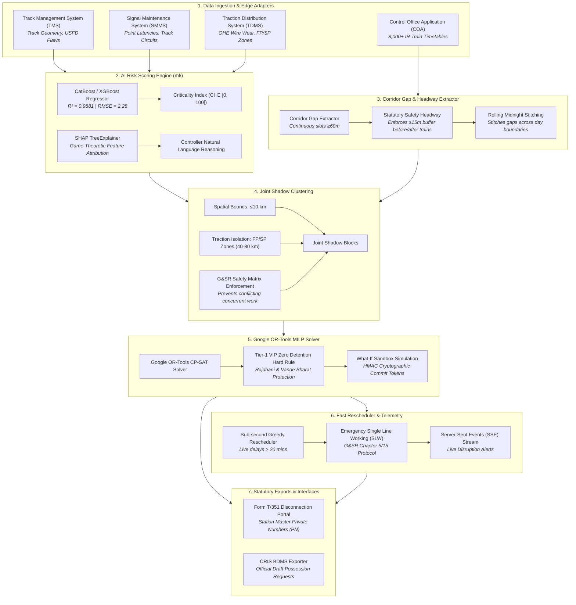

# 🚆 RailBlock — AI-Powered Automatic Block Planning System
### Smart India Hackathon 2026 | Problem Statement 26027
**Organization:** Ministry of Railways (CRIS / RDSO)  
**Theme:** Transportation & Logistics | **Category:** Software  

---

## 📌 Executive Summary

Railway infrastructure maintenance across Indian Railways operates across three distinct engineering divisions:
* **Civil Engineering (Tracks & Rails):** Track Management System (TMS)
* **Signal & Telecom (S&T):** Signalling Maintenance & Management System (SMMS)
* **Traction Distribution (TRD / Electrical):** Traction Distribution Management System (TDMS)

Independent departmental corridor possessions cause repeated solo track closures, passenger train detentions, and diminished network capacity.

**RailBlock** is a centralized decision-support and constraint-optimization platform that coordinates multi-departmental maintenance requests, identifies continuous traffic downtime gaps, bundles compatible tasks into **Joint Shadow Blocks**, and solves optimal schedules using **Google OR-Tools Mixed-Integer Linear Programming (MILP)** while strictly enforcing **G&SR statutory safety rules** and protecting high-priority passenger corridors (Rajdhani, Vande Bharat, Shatabdi).

---

## 🏗️ System Architecture & 7-Stage Pipeline Workflow



---

## ⚡ Stage-by-Stage Functional Breakdown

* **Stage 1 — Multi-System Data Ingestion & Adapters:** Ingests maintenance defect requisitions from **TMS** (Civil Track), **SMMS** (Signal & Telecom), **TDMS** (Traction Distribution/Electrical), and train movements from **COA**. Edge adapters (`adapters.py`) normalize incoming requisitions into uniform `MaintenanceRequest` domain objects.
* **Stage 2 — AI Risk & Criticality Scoring Engine:** Predicts a dynamic **Criticality Index ($CI \in [0, 100]$)** using gradient boosted trees (CatBoost/XGBoost) trained on domain-grounded Indian Railways degradation parameters. Evaluates feature contributions using **SHAP** to produce controller-facing explanations.
* **Stage 3 — Corridor Gap & Headway Extractor:** Analyzes COA timetables to identify unoccupied track windows ($\ge 60\text{ min}$) with statutory **$\ge 15\text{ min}$ safety headways** before and after train movements, stitching gaps across midnight rolling boundaries.
* **Stage 4 — Joint Shadow Block Clustering:** Bundles compatible multi-department maintenance tasks occurring within $\le 10\text{ km}$ spatial bounds and Substation Feeding Post (FP) / Sectioning Post (SP) electrical power zones ($40\text{--}80\text{ km}$), strictly enforcing the **G&SR Statutory Safety Conflict Matrix**.
* **Stage 5 — Google OR-Tools CP-SAT MILP Optimization Solver:** Formulates a Space-Time Mixed-Integer Linear Programming (MILP) model. Enforces **hard zero-detention constraints for Tier 1 VIP trains (Rajdhani, Vande Bharat, Shatabdi)** while optimizing block placement, shadow overlap hours, and equipment resource availability.
* **Stage 6 — Real-Time Fast Rescheduler & Emergency Protocol:** Triggers sub-second greedy time-shifting when live train delays exceed $20\text{ minutes}$. Automatically generates **G&SR Chapter 5/15 Single Line Working (SLW)** emergency advisories if block overruns threaten traffic flow.
* **Stage 7 — Statutory Form T/351 & CRIS BDMS Exporters:** Enforces digital Station Master **Private Number (PN)** exchanges for track disconnections/reconnections and exports draft possession requests directly in official **CRIS BDMS JSON format**.

---

## 🤖 AI / ML Risk Engine & Explainability (Stage 2 Deep-Dive)

### 📊 Feature Engineering Matrix

| Feature Name | Type | Range | Department | Domain Description |
| :--- | :---: | :---: | :---: | :--- |
| **`tgi_deviation`** | `float` | `0.0` -- `100.0` | Track (TMS) | Deviation from standard Track Geometry Index ($100 - \text{TGI}$). |
| **`speed_restriction_kmh`**| `float` | `0.0` -- `100.0` | All | Speed drop delta ($\text{MPS} - v_{\text{TSR}}$). |
| **`days_overdue`** | `float` | `0.0` -- `60.0` | All | Days elapsed past statutory maintenance deadline. |
| **`section_gmt_density`** | `float` | `5.0` -- `150.0` | All | Annual Gross Million Tonnes carried by section (traffic density). |
| **`department_code`** | `int` | `0, 1, 2` | All | `0`: Track (TMS), `1`: Signal (SMMS), `2`: Traction (TDMS). |
| **`usfd_flaw_severity`** | `int` | `0` -- `3` | Track (TMS) | `0`: None, `1`: OBS, `2`: REM, `3`: `IMR` (*Immediate Removal*). |
| **`point_failure_risk`** | `float` | `0.0` -- `100.0` | Signal (SMMS) | S&T Point machine locking latency failure risk ($>4.5\text{s}$). |
| **`ohe_insulator_wear`** | `float` | `0.0` -- `100.0` | Traction (TDMS) | OHE contact wire wear percentage ($>20\text{--}30\%$ limit). |

---

### 🔬 ML Models & Mathematical Theory

#### 1. XGBoost (Extreme Gradient Boosting)
* **Mathematical Theory:** Minimizes a regularized objective function using a 2nd-order Taylor expansion:
$$\mathcal{L}^{(t)} = \sum_{i=1}^n l\left(y_i, \hat{y}_i^{(t-1)} + f_t(x_i)\right) + \gamma T + \frac{1}{2}\lambda \sum_{j=1}^T w_j^2$$
Optimal leaf weight $w_j^*$ for leaf $j$ with gradients $g_i$ and Hessians $h_i$:
$$w_j^* = -\frac{\sum_{i \in I_j} g_i}{\sum_{i \in I_j} h_i + \lambda}$$
* **Implementation & Results:** Optimized via Optuna in `ml/train.py`. Achieved 5-fold CV RMSE of **`2.6322`**.

#### 2. LightGBM (Light Gradient Boosting Machine)
* **Mathematical Theory:** Uses **Leaf-wise (best-first)** tree growth and **Gradient-based One-Side Sampling (GOSS)** to inspect instances with larger gradients.
* **Implementation & Results:** Evaluated in Optuna study. Achieved 5-fold CV RMSE of **`2.7775`**.

#### 3. CatBoost (Categorical Boosting) — 🏆 Winning Model
* **Mathematical Theory:** Employs **Ordered Boosting** to prevent target leakage and **Symmetric (Oblivious) Trees** where every node at a given level uses the exact same split condition. This guarantees fast hardware SIMD vectorization and prevents overfitting.
* **Implementation & Results:** **Won the model benchmark** with 5-fold CV RMSE of **`2.3476`**.
* **Final Test Evaluation Metrics:**
  * **$R^2 \text{ Score} = 0.9881$** (Target: $\ge 0.95$) ✅
  * **$\text{RMSE} = 2.2866$** (Target: $\le 3.5$) ✅
  * **$\text{MAE} = 1.7358$** (Target: $\le 2.5$) ✅
* Model Artifact: `backend/data/ml_models/criticality_xgboost_v2.joblib`

#### 4. SHAP (SHapley Additive exPlanations)
* **Mathematical Theory:** Game-theoretic feature attributions computing exact marginal contributions across feature subsets $S$:
$$\phi_i(x) = \sum_{S \subseteq F \setminus \{i\}} \frac{|S|!(|F| - |S| - 1)!}{|F|!} \left[ f\left(S \cup \{i\}\right) - f(S) \right]$$
* **Output:** Generates human-readable controller reasonings (e.g., *"Job rated 88.4/100 [CRITICAL] primarily driven by USFD Ultrasonic Rail Flaw (+36.5 pts)"*). Diagnostic plots saved in `ml/reports/`.

---

## 📂 Project Directory Structure

```text
SIH26-RailBlock/
├── backend/
│   ├── alembic/                 # Database schema migration scripts (Alembic)
│   ├── app/
│   │   ├── api/                 # FastAPI REST Endpoint Routers (auth, blocks, optimizer, risk, events)
│   │   ├── core/                # System configuration, Async SQLAlchemy session, JWT & RBAC security
│   │   ├── models/              # SQLAlchemy 2.0 async database ORM models (9 tables)
│   │   ├── schemas/             # Pydantic v2 validation & response contracts
│   │   ├── services/            # Pure computational engines (gap_extractor, clustering, optimizer, rescheduler)
│   │   └── main.py              # Application factory & middleware setup
│   ├── data/
│   │   ├── raw/                 # Real IR Open Data (8,990 Stations & 8,000+ Trains)
│   │   ├── ml_models/           # Exported production models (criticality_xgboost_v2.joblib)
│   │   └── seed_all.py          # Database seeder script
│   ├── tests/                   # Automated pytest suite (111 passing tests)
│   ├── Dockerfile               # Multi-stage production container configuration
│   ├── entrypoint.sh            # Auto-migration + seed + server startup script
│   └── requirements.txt         # Production backend dependencies
│
├── ml/                          # Dedicated Offline AI/ML Development Workspace
│   ├── data/
│   │   ├── synthetic_generator.py # Domain-grounded IR dataset generator (6,000 samples)
│   │   └── ir_defects_dataset.csv # Output synthetic dataset
│   ├── reports/                 # Diagnostic plots (feature_importance.png, shap_beeswarm_summary.png)
│   ├── train.py                 # Optuna hyperparameter tuning (XGBoost, LightGBM, CatBoost)
│   ├── evaluate.py              # Benchmark evaluation (R², RMSE, MAE) & diagnostic report generator
│   ├── explainer.py             # SHAP TreeExplainer & controller reasoning string builder
│   └── requirements-ml.txt      # Dedicated ML dependencies
│
├── docs/                        # Specifications & 6 Architectural Decision Records (ADRs)
├── CONTEXT.md                   # Canonical Railway Domain Glossary
├── docker-compose.yml           # Multi-container orchestration (PostgreSQL 15, pgAdmin, Backend)
└── README.md                    # Main documentation
```

---

## 🐳 Docker Deployment & Quickstart

RailBlock is fully containerized with multi-container orchestration.

### Prerequisites
* **Docker & Docker Compose** installed on your system.

---

### Step 1: Clone Repository & Configure Environment

```bash
git clone https://github.com/Santo29SL/SIH26-RailBlock.git
cd SIH26-RailBlock

# Copy environment template
cp .env.example .env
```

---

### Step 2: Launch Full Application Stack with One Command

```bash
docker compose up -d
```

This automatically:
1. Provisions **PostgreSQL 15** on port `5433` and **pgAdmin 4** on `http://localhost:5050`.
2. Runs database migrations (`alembic upgrade head`).
3. Seeds real Indian Railways stations (8.9k), trains (8k+), and maintenance requisitions.
4. Starts the **FastAPI Backend Core** on `http://localhost:8000`.

---

### Step 3: Access Interactive API Documentation

* **Interactive Swagger UI:** `http://localhost:8000/docs`
* **ReDoc Documentation:** `http://localhost:8000/redoc`
* **pgAdmin Console:** `http://localhost:5050` (*Email: admin@railblock.dev | Password: admin*)

---

## 📑 Core API Reference

| Endpoint | Method | Description |
| :--- | :---: | :--- |
| `/api/v1/auth/login` | `POST` | Authenticate user & receive JWT access + refresh tokens |
| `/api/v1/sections` | `GET` | Retrieve list of railway sections with station markers |
| `/api/v1/train-movements` | `GET` | List timetabled train movements on a specific section |
| `/api/v1/maintenance` | `GET` | List pending maintenance requests across Track, Signal, and Traction |
| `/api/v1/optimizer/run` | `POST` | Execute Stage 3 $\to$ 4 $\to$ 5 solver and persist scheduled blocks |
| `/api/v1/optimizer/simulate` | `POST` | Pure in-memory What-If scenario simulation with HMAC commit token |
| `/api/v1/optimizer/commit-simulation` | `POST` | Commit simulated schedule to DB using verified HMAC token |
| `/api/v1/blocks/{id}/transition` | `POST` | Form T/351 Private Number exchange state machine transition |
| `/api/v1/blocks/{id}/export-bdms` | `GET` | Export approved block in official CRIS BDMS draft JSON format |
| `/api/v1/blocks/{id}/t351-notice` | `GET` | Export statutory Form T/351 Disconnection Notice payload |
| `/api/v1/risk/score` | `POST` | Predict Criticality Index ($CI \in [0, 100]$) and SHAP factor attribution |
| `/api/v1/events/telemetry` | `GET` | Server-Sent Events (SSE) live train delay broadcast stream |

---

## 📜 Architectural Decision Records (ADRs)

Key architectural decisions are documented under [`docs/adr/`](file:///Users/santhoshsl/RailBlock/docs/adr/):
* **ADR 0001:** Two-Tier Optimization Architecture (Offline MILP + Real-Time Greedy Heuristic)
* **ADR 0002:** Read-Only Edge Gateway & RailNet Air-Gap Security
* **ADR 0003:** Tiered Train Detention & Zero-Tolerance VIP Timetable Protection
* **ADR 0004:** Directional Track Possession & Flexible Internal Shadow Offsets
* **ADR 0005:** Statutory Block Lifecycle & Station Master Private Number State Machine
* **ADR 0006:** In-Memory What-If Simulation with HMAC Commit Tokens

---

## ⚖️ License & Compliance Disclaimer

Developed for the **Smart India Hackathon (SIH 2026)** under Problem Statement **26027** for the **Ministry of Railways**.  
*All railway schedules, stations, and operational logic conform to Indian Railways General & Subsidiary Rules (G&SR) and IRPWM standards.*
