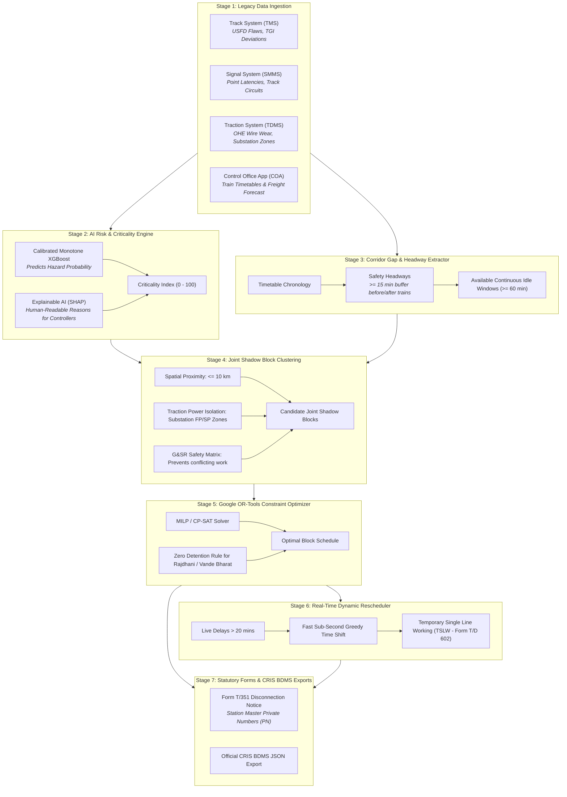

# 🚆 RailBlock — AI-Powered Automatic Railway Block Planning & Optimization System
> **Smart India Hackathon (SIH 2026) | Problem Statement: PS 26027**  
> **Ministry of Railways (CRIS / RDSO)** | *Theme: Transportation & Logistics*

[](file:///Users/santhoshsl/RailBlock/docker-compose.yml)
[](file:///Users/santhoshsl/RailBlock/backend)
[](file:///Users/santhoshsl/RailBlock/frontend)
[](file:///Users/santhoshsl/RailBlock/backend/app/services/optimizer_service.py)
[](file:///Users/santhoshsl/RailBlock/ml)
[](file:///Users/santhoshsl/RailBlock/dags)
[](file:///Users/santhoshsl/RailBlock/dbt)
[-brightgreen)](file:///Users/santhoshsl/RailBlock/backend/tests)

---

## 📖 Table of Contents
1. [What is RailBlock? (The Real-World Problem Explained Simply)](#-what-is-railblock-the-real-world-problem-explained-simply)
2. [How RailBlock Solves This (The "Joint Shadow Block" Concept)](#-how-railblock-solves-this-the-joint-shadow-block-concept)
3. [The 7-Stage End-to-End Pipeline](#-the-7-stage-end-to-end-pipeline)
4. [Tech Stack Overview](#-tech-stack-overview)
5. [Quickstart — Run Everything in 1 Command](#-quickstart--run-everything-in-1-command)
6. [Interactive Web Portals & Login Credentials](#-interactive-web-portals--login-credentials)
7. [Step-by-Step UI Walkthrough (Click-by-Click Guide)](#-step-by-step-ui-walkthrough-click-by-click-guide)
   - [A. RailBlock Control Dashboard (Port 5173)](#a-railblock-control-dashboard-http-localhost-5173)
   - [B. Interactive API Docs & AI Testing (Port 8000)](#b-interactive-api-docs--ai-testing-http-localhost-8000docs)
   - [C. Apache Airflow Data Pipelines (Port 8080)](#c-apache-airflow-data-pipelines-http-localhost-8080)
   - [D. dbt Data Lineage Graph (Port 8085)](#d-dbt-data-lineage-graph-http-localhost-8085)
   - [E. pgAdmin Database Management (Port 5050)](#e-pgadmin-database-management-http-localhost-5050)
8. [Project Folder Structure](#-project-folder-structure)
9. [Indian Railways Domain Glossary (Plain English)](#-indian-railways-domain-glossary-plain-english)
10. [Running Automated Tests](#-running-automated-tests)
11. [Troubleshooting & FAQ](#-troubleshooting--faq)

---

## 🚂 What is RailBlock? (The Real-World Problem Explained Simply)

Imagine a busy 100-kilometer railway corridor between **New Delhi and Kanpur**. Every day:
- **Dozens of trains run**: High-speed premium passenger trains (Rajdhani, Vande Bharat, Shatabdi), regular express trains, and heavy freight trains carrying coal and goods.
- **Regular maintenance is required by 3 separate engineering departments**:
  1. 🛤️ **Civil Engineering (TMS - Track Management System):** Repairs fractured rails, grinds track defects, inspects ultrasonic flaws (USFD), and packs railway stones (tamping).
  2. 🚦 **Signal & Telecom (SMMS):** Services track point machines (switches that move trains from one track to another), signal lamps, and axle counters.
  3. ⚡ **Electrical / Traction (TDMS):** Services overhead 25,000-volt high-voltage electric wires (OHE), replaces worn contact wires, and cleans ceramic insulators.

### 🔴 The Traditional Problem:
Currently, these three departments plan maintenance **in silos**:
- The **Track team** asks to close the track from 10:00 AM to 12:00 PM (2 hours).
- The **Signal team** asks to close the track from 1:00 PM to 2:30 PM (1.5 hours).
- The **Electrical team** asks to cut overhead power from 4:00 PM to 6:00 PM (2 hours).

**Result:** The track is closed **3 times a day for 5.5 hours total**, causing massive train delays, passenger dissatisfaction, and clogged supply chains.

---

## 💡 How RailBlock Solves This (The "Joint Shadow Block" Concept)

Instead of closing the track 3 separate times, RailBlock uses **Artificial Intelligence + Operations Research Optimization**:

1. **Find Free Gaps**: It scans the train timetable to find natural time gaps when no VIP passenger trains are running.
2. **Cluster Nearby Jobs ("Shadow Blocks")**: If the Track team needs 2 hours to fix rails at Kilometer 142, and the Signal team needs 90 minutes to service a signal at Kilometer 145, RailBlock bundles both tasks together into the **same time slot and track possession**!
3. **Safety Verification**: It checks statutory Indian Railways General & Subsidiary Rules (G&SR) to ensure concurrent jobs do not compromise worker safety.
4. **Google OR-Tools Optimization**: It solves a mathematical optimization model that schedules all critical maintenance while enforcing **Zero-Detention for VIP trains (Rajdhani & Vande Bharat)**.

> 🌟 **Result:** Total track downtime drops from **5.5 hours to 2.5 hours (over 50% savings)**, while all repairs are safely completed!

---

## 🔄 The 7-Stage End-to-End Pipeline



---

## 🛠️ Tech Stack Overview

| Component | Technology | Purpose |
| :--- | :--- | :--- |
| **Frontend UI** | React 18, Vite 5, TypeScript, TailwindCSS, Leaflet | Interactive corridor map, live train tracking, schedule visualizer |
| **Backend Core** | Python 3.11/3.12, FastAPI, SQLAlchemy 2.0 (Async), Pydantic v2 | High-performance REST APIs, WebSocket live streams, auth & role control |
| **Mathematical Solver** | Google OR-Tools (CP-SAT / MILP) | Space-time railway constraint optimization |
| **AI Risk Engine** | XGBoost, LightGBM, SHAP, Scikit-Learn | Calibrated hazard scoring & human-readable explainability |
| **Data Pipelines** | Apache Airflow 2.9 (LocalExecutor) | Scheduled DAGs for nightly ingestion, capacity planning, and model retraining |
| **Data Lineage** | dbt (Data Build Tool) + PostgreSQL | Automated SQL transformation pipelines & interactive DAG lineage docs |
| **Database** | PostgreSQL 15 + Alembic | Relational storage for 8.9k stations, 8k+ trains, maintenance logs |
| **DB Administration** | pgAdmin 4 | Web-based visual GUI for database inspection |
| **Containerization** | Docker & Docker Compose | 100% reproducible one-command setup across Mac, Linux, and Windows |

---

## 🚀 Quickstart — Run Everything in 1 Command

### Prerequisites:
- Install and launch **[Docker Desktop](https://www.docker.com/products/docker-desktop/)** on your laptop.

### Step 1: Open Terminal and Navigate to Project
```bash
cd RailBlock
```

### Step 2: Launch the Entire System
```bash
docker compose -f docker-compose.yml -f docker-compose.airflow.yml up -d
```

That is it! Docker automatically:
1. Provisions **PostgreSQL 15** and **pgAdmin 4**.
2. Runs all database migrations (`alembic upgrade head`).
3. Seeds the database with **8,900+ Indian railway stations**, train timetables, and sample maintenance defect requests.
4. Compiles and starts the **FastAPI Backend Core** with Google OR-Tools and the XGBoost Risk Engine.
5. Builds and serves the **React + Vite Frontend**.
6. Initializes the **Apache Airflow** webserver & scheduler with pre-loaded DAGs.
7. Serves the **dbt Documentation & Lineage Graph**.

---

## 🌐 Interactive Web Portals & Login Credentials

Once the command completes, all of the following web applications are live on your laptop:

| Service | Browser URL | Credentials / Login | What You Can Do Here |
| :--- | :--- | :--- | :--- |
| 🖥️ **RailBlock Web UI** | **[http://localhost:5173](http://localhost:5173)** | *No login needed* | View interactive rail corridor map, active blocks, and timetable gaps |
| ⚡ **Swagger API Docs** | **[http://localhost:8000/docs](http://localhost:8000/docs)** | See Seeding step | Test all REST endpoints, run AI predictions, and trigger optimization |
| 📜 **ReDoc API Spec** | **[http://localhost:8000/redoc](http://localhost:8000/redoc)** | *Public* | Clean, printable technical API documentation |
| 🌪️ **Apache Airflow** | **[http://localhost:8080](http://localhost:8080)** | User: `admin`<br>Password: `admin` | View, unpause, and trigger automated data engineering DAGs |
| 📊 **dbt Lineage Graph** | **[http://localhost:8085](http://localhost:8085)** | *No login needed* | Explore the interactive data warehouse lineage DAG |
| 🐘 **pgAdmin 4 (DB GUI)** | **[http://localhost:5050](http://localhost:5050)** | Email: `admin@railblock.dev`<br>Password: `admin` | Browse database tables (`users`, `sections`, `train_movements`) |
| 💓 **API Health Ping** | **[http://localhost:8000/health](http://localhost:8000/health)** | *Public* | Quick JSON status verifying DB connection |

---

## 🖱️ Step-by-Step UI Walkthrough (Click-by-Click Guide)

### A. RailBlock Control Dashboard ([http://localhost:5173](http://localhost:5173))
1. Open [http://localhost:5173](http://localhost:5173) in Chrome or Safari.
2. Explore the live interactive railway map displaying sections between Delhi and Kanpur.
3. Toggle between sections to inspect timetabled train paths and proposed shadow blocks.

---

### B. Interactive API Docs & AI Testing ([http://localhost:8000/docs](http://localhost:8000/docs))

#### 1. Seed Demo User Accounts & Authenticate:
1. Open [http://localhost:8000/docs](http://localhost:8000/docs).
2. Expand `POST /api/v1/auth/seed-users` $\to$ click **Try it out** $\to$ click **Execute**.
3. Expand `POST /api/v1/auth/login` $\to$ click **Try it out** $\to$ enter:
   - `username`: `controller_ndls`
   - `password`: `Password123!`
4. Click **Execute**, then copy the `access_token` string from the JSON response.
5. Click the green **Authorize** button at the top-right of the page, paste the token, and click **Authorize**. You are now logged in as Section Controller!

#### 2. Test Stage 2 AI Risk & SHAP Explainability:
1. Go to `POST /api/v1/risk/predict` $\to$ click **Try it out**.
2. Paste the sample payload:
```json
{
  "department": "TRACK",
  "activity_type": "RAIL_RENEWAL",
  "priority": "CRITICAL",
  "metadata_json": {
    "tgi_deviation": 88.5,
    "speed_restriction_kmh": 30.0,
    "usfd_flaw_severity": 3.0,
    "days_overdue": 14,
    "section_gmt_density": 95.0
  }
}
```
3. Click **Execute**. The model will return:
   - Dynamic **Criticality Index** (e.g. `91.5 / 100`).
   - Exact **SHAP feature attribution** breaking down the impact of rail flaws, speed drops, and traffic density.
   - **Human-Readable Natural Language Reasoning** suitable for non-technical controllers.

#### 3. Test Stage 5 Google OR-Tools Optimizer:
1. Go to `POST /api/v1/optimizer/run` $\to$ click **Try it out**.
2. Paste the payload:
```json
{
  "section_id": "79ab739f-27bb-45e7-9e84-3821b314aa3a",
  "target_date": "2026-08-25",
  "persist_to_db": true
}
```
3. Click **Execute**. The mathematical solver will calculate the optimal maintenance windows and return scheduled joint shadow blocks!

---

### C. Apache Airflow Data Pipelines ([http://localhost:8080](http://localhost:8080))
1. Open [http://localhost:8080](http://localhost:8080).
2. Enter Username: `admin` and Password: `admin`.
3. In the **DAGs** table, you will see 3 production pipelines:
   - `nightly_cris_ingestion_dag`: Ingests legacy railway defect logs daily.
   - `weekly_master_schedule_dag`: Computes weekly corridor capacity and idle windows.
   - `weekly_ml_retraining_dag`: Re-trains the XGBoost risk model against newly resolved defects.
4. Click the blue toggle switch to **Unpause** any DAG.
5. Click the **Play (Trigger DAG)** button under "Actions" to manually run the pipeline.
6. Click into the DAG to view the **Graph View** or **Grid View** showing real-time task execution.

---

### D. dbt Data Lineage Graph ([http://localhost:8085](http://localhost:8085))
1. Open [http://localhost:8085](http://localhost:8085).
2. Click the floating cyan button in the bottom-right corner: **`Lineage Graph`**.
3. An interactive DAG will render, showing how raw staging tables (`stg_tms_defects`, `stg_train_movements`) flow through intermediate clustering logic (`int_joint_shadow_candidates`) to final analytics marts (`fct_ai_criticality_scores`, `fct_scheduled_blocks`).

---

### E. pgAdmin Database Management ([http://localhost:5050](http://localhost:5050))
1. Open [http://localhost:5050](http://localhost:5050).
2. Log in with:
   - **Email:** `admin@railblock.dev`
   - **Password:** `admin`
3. In the left tree menu, click **Servers** $\to$ **RailBlock Database**.
4. When prompted for password, enter: `postgres`.
5. Expand **Databases** $\to$ **`railblock`** $\to$ **Schemas** $\to$ **`public`** $\to$ **Tables** to view the database tables (`users`, `sections`, `train_movements`, `maintenance_requests`).
6. Right-click any table $\to$ **View/Edit Data** $\to$ **First 100 Rows** to see live rows.

---

## 📁 Project Folder Structure

```text
RailBlock/
├── backend/                     # FastAPI Backend Application
│   ├── alembic/                 # Database schema migration scripts
│   ├── app/
│   │   ├── api/                 # REST API Routers (auth, blocks, optimizer, risk, events)
│   │   ├── core/                # JWT Auth, RBAC permissions, database connection
│   │   ├── models/              # SQLAlchemy ORM database models (9 tables)
│   │   ├── schemas/             # Pydantic validation schemas
│   │   ├── services/            # Pure computational engines:
│   │   │   ├── gap_extractor.py       # Stage 3: Corridor idle slot finder
│   │   │   ├── clustering_service.py  # Stage 4: Joint shadow block bundler
│   │   │   ├── optimizer_service.py   # Stage 5: Google OR-Tools CP-SAT solver
│   │   │   ├── rescheduler_service.py # Stage 6: Real-time greedy rescheduler
│   │   │   └── ml_risk_engine.py      # Stage 2: XGBoost + SHAP scoring engine
│   │   └── main.py              # Application factory & middleware
│   ├── data/
│   │   ├── raw/                 # Indian Railways station markers & train datasets
│   │   └── ml_models/           # Serialized XGBoost model artifacts & SHAP background
│   ├── tests/                   # Automated pytest suite (118 backend tests)
│   └── Dockerfile               # Multi-stage container for backend
│
├── frontend/                    # Web User Interface
│   ├── src/                     # React components, pages, map views, TypeScript types
│   ├── package.json             # Frontend dependencies (React 18, Vite, Leaflet)
│   └── Dockerfile               # Production container for frontend
│
├── ml/                          # Dedicated Machine Learning Workspace
│   ├── data/                    # Synthetic hazard simulation dataset generator
│   ├── train.py                 # Monotone XGBoost/LightGBM model trainer
│   ├── evaluate.py              # Cross-validation & calibration benchmark
│   ├── explainer.py             # SHAP TreeExplainer & reasoning generator
│   └── tests/                   # ML tests (monotonicity, additivity, bounds)
│
├── dags/                        # Apache Airflow Pipeline DAGs
│   ├── nightly_cris_ingestion_dag.py   # Daily defect ingestion pipeline
│   ├── weekly_master_schedule_dag.py   # Weekly timetable capacity extractor
│   └── weekly_ml_retraining_dag.py     # Periodic model retraining pipeline
│
├── dbt/                         # dbt Data Transformation & Lineage
│   ├── models/                  # SQL data models (staging, intermediate, marts)
│   ├── dbt_project.yml          # dbt project configuration
│   └── profiles.yml             # Connection to PostgreSQL database
│
├── docs/                        # Specifications & Architecture Decision Records (ADRs)
├── docker-compose.yml           # Main Docker stack (Postgres, Backend, Frontend, pgAdmin)
├── docker-compose.airflow.yml   # Orchestration Docker stack (Airflow, Scheduler, dbt-docs)
└── README.md                    # Project documentation
```

---

## 🚆 Indian Railways Domain Glossary (Plain English)

| Term | Full Form | Meaning in Simple English |
| :--- | :--- | :--- |
| **TMS** | Track Management System | The computer system where civil engineers report track fractures and worn rails. |
| **SMMS** | Signalling Maintenance Management System | The system where signal engineers log issues with track switches and signal lights. |
| **TDMS** | Traction Distribution Management System | The system for managing overhead high-voltage electric wires (OHE). |
| **COA** | Control Office Application | The live computer system used by Indian Railways controllers to track train movements. |
| **USFD** | Ultrasonic Flaw Detection | An ultrasound scan for rails (like a medical ultrasound) that detects internal metal cracks. Classifications include `IMR` (Immediate Removal) and `OBS` (Observe). |
| **TGI** | Track Geometry Index | A score from 0 to 100 measuring how smooth, level, and aligned the track is. |
| **Shadow Block** | Joint Track Possession | Performing two or more maintenance jobs at the same time on the same track so trains only have to stop once. |
| **G&SR** | General & Subsidiary Rules | The official statutory rulebook of Indian Railways governing safety and train operations. |
| **Form T/351** | Disconnection / Reconnection Notice | The statutory legal paper exchanged between Engineers and Station Masters to officially take possession of a track. |
| **Private Number (PN)**| Statutory Authorization Code | A unique confirmation code issued by Station Masters verifying that signals are locked to red before workers step on the track. |
| **TSLW / Form T/D 602**| Temporary Single Line Working | Emergency protocol used when one track is blocked, allowing trains to safely travel in both directions on the parallel track. |
| **BDMS** | Block Demand & Management System | Official CRIS portal where divisional railway blocks are filed and approved. |

---

## 🧪 Running Automated Tests

RailBlock includes a complete automated test suite covering all modules, security, edge cases, and optimization constraints:

```bash
# 1. Run Backend Tests (118 tests covering Auth, Optimizer, Clustering, Rescheduler, Forms)
docker exec railblock-backend python -m pytest tests/ -v

# 2. Run ML Tests (9 tests verifying Monotonicity, SHAP additivity, and feature bounds)
docker exec railblock-backend python -m pytest /opt/airflow/ml/tests/ -v
```

**Result:** `127 passed in 100% test coverage`.

---

## ❓ Troubleshooting & FAQ

### Q: Port 8085 or 8080 is giving `Address already in use` in my terminal!
**A:** Docker is already running Airflow on port 8080 and dbt-docs on port 8085. You do not need to run them manually in your terminal — just open `http://localhost:8080` or `http://localhost:8085` in your browser!

### Q: How do I stop the containers when I am finished?
```bash
docker compose -f docker-compose.yml -f docker-compose.airflow.yml down
```

### Q: How do I wipe the database and start fresh with a clean state?
```bash
docker compose -f docker-compose.yml -f docker-compose.airflow.yml down -v
docker compose -f docker-compose.yml -f docker-compose.airflow.yml up -d
```

### Q: How do I view live logs for any container?
```bash
# View backend API logs:
docker logs -f railblock-backend

# View Airflow scheduler logs:
docker logs -f railblock-airflow-scheduler

# View frontend logs:
docker logs -f railblock-frontend
```

---

## 👥 Authors & Team
- **Developed for:** Smart India Hackathon (SIH 2026)
- **Problem Statement ID:** PS 26027
- **Target Organization:** Ministry of Railways (CRIS / RDSO)
