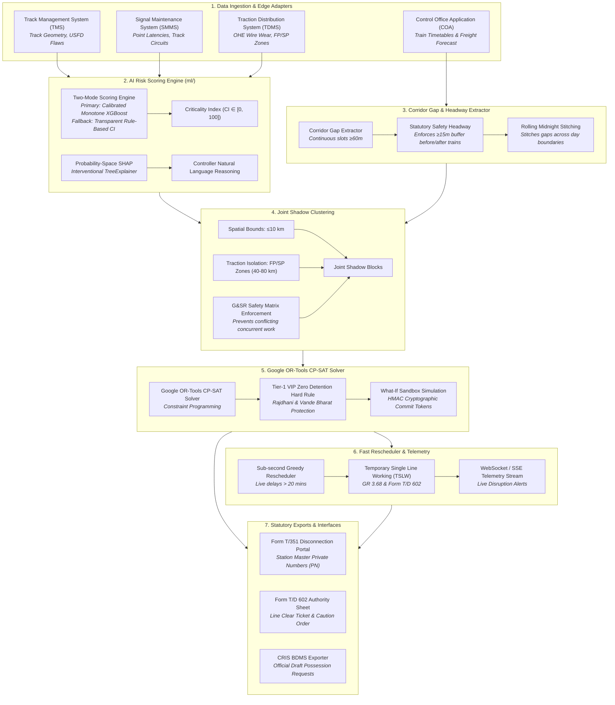

# 🚆 RailBlock — AI-Powered Automatic Block Planning System
### Smart India Hackathon 2026 | Problem Statement 26027
**Organization:** Ministry of Railways (CRIS / RDSO)  
**Theme:** Transportation & Logistics | **Category:** Software  

---

## 📌 Executive Summary

Railway infrastructure maintenance across Indian Railways operates across three distinct engineering divisions:
* **Civil Engineering (Tracks & Rails):** Track Management System (TMS)
* **Signal & Telecom (S&T):** Signalling Maintenance & Management System (SMMS)
* **Traction Distribution (TRD / Electrical):** Traction Distribution Management System (TDMS)

Independent departmental corridor possessions cause repeated solo track closures, passenger train detentions, and diminished network capacity.

**RailBlock** is a centralized decision-support and constraint-optimization platform that coordinates multi-departmental maintenance requests, identifies continuous traffic downtime gaps, bundles compatible tasks into **Joint Shadow Blocks**, and solves optimal schedules using **Google OR-Tools Constraint Programming (CP-SAT)** while strictly enforcing **G&SR statutory safety rules** and protecting high-priority passenger corridors (Rajdhani, Vande Bharat, Shatabdi).

---

## 🏗️ System Architecture & 7-Stage Pipeline Workflow



---

## ⚡ Stage-by-Stage Functional Breakdown

* **Stage 1 — Multi-System Data Ingestion & Adapters:** Ingests maintenance defect requisitions from **TMS** (Civil Track), **SMMS** (Signal & Telecom), **TDMS** (Traction Distribution/Electrical), and train movements & goods trains forecast from **COA**. Edge adapters (`adapters.py`) normalize incoming requisitions into uniform `MaintenanceRequest` domain objects supporting standard IRPWM USFD classifications (`GOOD`, `IMR`, `IMRW`, `OBS`, `OBSW`) and Track Geometry Curvature.
* **Stage 2 — AI Risk & Criticality Scoring Engine:** Predicts a dynamic **Criticality Index ($CI \in [0, 100]$)** using a **Two-Mode Scoring Architecture**:
  * **Primary Deployed Model (Mode 2):** Monotone-constrained Gradient Boosted Trees (`XGBoost` / `LightGBM`) trained on simulated 30-day failure hazard outcomes with domain randomization and feature interactions, post-hoc isotonic-calibrated, and served with probability-space **SHAP** attributions.
  * **Deterministic Fallback & Baseline (Mode 1):** A transparent expert-weighted linear formula used when model artifacts are absent and as the comparative baseline in evaluation. Incorporates the statutory **Availability-Impact Dimension** ($\text{MPS} - v_{\text{TSR}}$).
* **Stage 3 — Corridor Gap & Headway Extractor:** Analyzes COA timetables and goods trains forecast (`FORECAST_FREIGHT`) to identify unoccupied track windows ($\ge 60\text{ min}$) with statutory **$\ge 15\text{ min}$ safety headways** before and after train movements, stitching gaps across midnight rolling boundaries.
* **Stage 4 — Joint Shadow Block Clustering:** Bundles compatible multi-department maintenance tasks occurring within $\le 10\text{ km}$ spatial bounds and Substation Feeding Post (FP) / Sectioning Post (SP) electrical power zones ($40\text{--}80\text{ km}$), strictly enforcing the **G&SR Statutory Safety Conflict Matrix**.
* **Stage 5 — Google OR-Tools CP-SAT Optimization Solver:** Formulates a Space-Time constraint programming model supporting multi-horizon planning (24h tactical, 7-day weekly, 30-day master via `horizon_days=7|30`). Enforces **hard zero-detention constraints for Tier 1 VIP trains (Rajdhani, Vande Bharat, Shatabdi)** while optimizing block placement and heavy machine fleet capacity limits.
* **Stage 6 — Real-Time Fast Rescheduler & Emergency Protocol:** Triggers sub-millisecond greedy time-shifting when live train delays exceed $20\text{ minutes}$. Automatically generates **Temporary Single Line Working (TSLW)** advisories per **GR 3.68 & zonal SR Chapters 4/15** with **Form T/D 602** support sheets and Section Controller control-phone scripts.
* **Stage 7 — Statutory Form T/351, Form T/D 602 & CRIS BDMS Exporters:** Enforces digital Station Master **Private Number (PN)** exchanges for track disconnections/reconnections, exports Form T/D 602 TSLW authority sheets, and exports draft possession requests directly in official **CRIS BDMS JSON format**.

---

## 🤖 AI / ML Risk Engine & Explainability (Stage 2 Deep-Dive)

### 📊 Feature Engineering Matrix

| Feature Name | Type | Range | Department | Domain Description |
| :--- | :---: | :---: | :---: | :--- |
| **`tgi_deviation`** | `float` | `0.0` -- `100.0` | Track (TMS) | Deviation from standard Track Geometry Index ($100 - \text{TGI}$) across Gauge, Cross-Level, Twist, Longitudinal Level, Alignment, and Curvature. |
| **`speed_restriction_kmh`**| `float` | `0.0` -- `120.0` | All | Speed drop delta ($\text{MPS} - v_{\text{TSR}}$), measuring impact on asset availability. |
| **`days_overdue`** | `float` | `0.0` -- `60.0` | All | Days elapsed past statutory maintenance deadline. |
| **`section_gmt_density`** | `float` | `5.0` -- `150.0` | All | Annual Gross Million Tonnes carried by section (traffic density). |
| **`department_code`** | `str` / `int` | `TRACK`, `SIGNAL`, `TRACTION` | All | Department identifier. |
| **`usfd_flaw_severity`** | `str` / `int` | `Good (0)`, `OBS (1)`, `OBSW (2)`, `IMR (3)`, `IMRW (4)` | Track (TMS) | Ultrasonic Flaw Detection category per IRPWM (T1 = IMR/IMRW, T2 = OBS/OBSW). |
| **`point_failure_risk`** | `float` | `0.0` -- `100.0` | Signal (SMMS) | S&T Point machine locking latency failure risk ($>4.5\text{s}$). |
| **`ohe_insulator_wear`** | `float` | `0.0` -- `100.0` | Traction (TDMS) | OHE contact wire wear percentage ($>20\text{--}30\%$ limit). |

---

### 🔬 ML Models & Evaluation Protocol

#### 1. Binary Maintenance Prioritization & Label Design
* **Synthetic Hazard Simulation:** Labels represent simulated 30-day failure outcomes: $y \sim \text{Bernoulli}\left(\sigma(\text{logit}_0 + \sum \beta_k f_k + \sum \gamma_{ij} \text{interaction}_{ij})\right)$ with domain randomization across 50 latent railway section regimes and configurable label noise (2–5%).
* **Non-Linear Interactions:** Incorporates domain physics including `usfd_flaw_severity × section_gmt_density`, `ohe_insulator_wear × section_gmt_density`, and `point_failure_risk × days_overdue`.

#### 2. Cross-Validation & Calibration Benchmark
* **Stratified Group K-Fold:** Evaluated via 5-fold `StratifiedGroupKFold` grouped by `section_id`, reserving a dedicated group-disjoint split exclusively for post-hoc Isotonic Calibration (`CalibratedClassifierCV`).
* **Evaluation Metrics:**
  * **PR-AUC (Headline Ranking Metric):** `0.2270` (Mean) / `0.2041` (Worst Fold).
  * **Precision@25:** `19.4%` (outperforming v1 rule baseline by `+0.9%` absolute).
  * **NDCG@25:** `0.9243` ranking fidelity against true hazard probabilities.
  * **Spearman $\rho$:** `0.8905` rank correlation.
* **Robustness:** Evaluated under heavy-freight covariate shift (`PR-AUC 0.7242`) and label noise degradation (98.9% rank retention under 5% noise).

#### 3. Probability-Space SHAP Explainability
* **Interventional TreeExplainer:** Built once on startup using a 200-sample background distribution:
  $$\text{base} + \sum_{i=1}^M \phi_i \approx P(\text{failure})$$
* **Human-Readable Natural Language Reasoning:**
  > *"Base failure rate 8%. USFD IMR flaw +21 pts, 80 km/h TSR +14, 14 days overdue +9, heavy-freight section +6, TGI deviation +3 → 61% simulated 30-day failure probability; CI 88 = riskier than 88% of the current backlog."*

---

## 📂 Project Directory Structure

```text
SIH26-RailBlock/
├── backend/
│   ├── alembic/                 # Database schema migration scripts (Alembic)
│   ├── app/
│   │   ├── api/                 # FastAPI REST Endpoint Routers (auth, blocks, optimizer, risk, events)
│   │   ├── core/                # System config, Async SQLAlchemy, JWT & 4+1-Tier RBAC
│   │   ├── models/              # SQLAlchemy 2.0 async database ORM models (9 tables)
│   │   ├── schemas/             # Pydantic v2 validation contracts with domain bounds
│   │   ├── services/            # Pure computational engines (gap_extractor, clustering, optimizer, rescheduler, ml_risk_engine)
│   │   └── main.py              # Application factory, rate limiting & logging middleware
│   ├── data/
│   │   ├── raw/                 # Synthetic Seed Sandbox calibrated to published IR statistics
│   │   ├── ml_models/
│   │   │   └── criticality_v1/  # Production ML artifact bundle (model.json, calibrator, schema, enums, ci_map, background, model_card)
│   │   └── seed_all.py          # Database seeder script
│   ├── tests/                   # Automated pytest suite (118 passing tests)
│   ├── Dockerfile               # Multi-stage production container configuration
│   ├── entrypoint.sh            # Auto-migration + seed + server startup script
│   └── requirements.txt         # Production backend dependencies
│
├── ml/                          # Dedicated Offline AI/ML Development Workspace
│   ├── config.py                # Global seed, feature definitions, domain bounds & v1 rule weights
│   ├── data/
│   │   ├── synthetic_generator.py # Hazard-based IR dataset generator (6,000 samples)
│   │   └── ir_defects_dataset.csv # Output synthetic dataset
│   ├── reports/
│   │   ├── eval_report.md       # Comprehensive evaluation benchmark & calibration report
│   │   ├── feature_importance.png # Feature importance diagnostic plot
│   │   └── shap_beeswarm_summary.png # SHAP beeswarm diagnostic plot
│   ├── train.py                 # Monotone XGBoost/LightGBM training with SGKF & Isotonic Calibration
│   ├── evaluate.py              # Ranking evaluation (PR-AUC, P@K, NDCG@K, Spearman, Shift, Noise)
│   ├── explainer.py             # Probability-space SHAP TreeExplainer & reasoning generator
│   ├── tests/                   # ML test suite (9 passing tests: additivity, monotonicity, bounds, fallback, leakage)
│   └── requirements-ml.txt      # Dedicated ML dependencies
│
├── frontend/                    # Control Office Application SPA (React + Vite + TailwindCSS)
├── docs/                        # Specifications & 6 Architectural Decision Records (ADRs)
├── CONTEXT.md                   # Canonical Railway Domain Glossary
├── docker-compose.yml           # Multi-container orchestration (PostgreSQL 15, pgAdmin, Backend)
└── README.md                    # Main documentation
```

---

## 🐳 Docker Deployment & Quickstart

RailBlock is containerized with multi-container orchestration.

### Prerequisites
* **Python 3.12+** and **`uv`**
* **Docker & Docker Compose**

---

### Step 1: Clone Repository & Configure Environment

```bash
git clone https://github.com/Santo29SL/SIH26-RailBlock.git
cd SIH26-RailBlock

# Copy environment template
cp .env.example .env
```

---

### Step 2: Launch Full Application Stack with One Command

```bash
docker compose up -d
```

This automatically:
1. Provisions **PostgreSQL 15** on port `5433` and **pgAdmin 4** on `http://localhost:5050`.
2. Runs database migrations (`alembic upgrade head`).
3. Seeds the synthetic sandbox representing 8.9k stations, 8k+ trains, and maintenance requisitions.
4. Starts the **FastAPI Backend Core** on `http://localhost:8000`.

---

### Step 3: Access Interactive API Documentation

* **Interactive Swagger UI:** `http://localhost:8000/docs`
* **ReDoc Documentation:** `http://localhost:8000/redoc`
* **pgAdmin Console:** `http://localhost:5050` (*Email: admin@railblock.dev | Password: admin*)

---

## 📑 Core API Reference

| Endpoint | Method | Description |
| :--- | :---: | :--- |
| `/api/v1/auth/login` | `POST` | Authenticate user & receive JWT access + refresh tokens |
| `/api/v1/sections` | `GET` | Retrieve list of railway sections with station markers |
| `/api/v1/train-movements` | `GET` | List timetabled train movements on a specific section |
| `/api/v1/maintenance` | `GET` | List pending maintenance requests across Track, Signal, and Traction |
| `/api/v1/optimizer/run?horizon_days=7\|30` | `POST` | Execute Stage 3 $\to$ 4 $\to$ 5 solver across 24h, 7-day (weekly), or 30-day (monthly) horizons |
| `/api/v1/optimizer/simulate` | `POST` | Pure in-memory What-If scenario simulation with HMAC commit token |
| `/api/v1/optimizer/commit-simulation` | `POST` | Commit simulated schedule to DB using verified HMAC token |
| `/api/v1/blocks/{id}/transition` | `POST` | Form T/351 Private Number exchange state machine transition |
| `/api/v1/blocks/{id}/export-bdms` | `GET` | Export approved block in official CRIS BDMS draft JSON format |
| `/api/v1/blocks/{id}/t351-notice` | `GET` | Export statutory Form T/351 Disconnection Notice payload |
| `/api/v1/blocks/{id}/td602-sheet` | `GET` | Export statutory Form T/D 602 TSLW line clear authority and caution order support sheet |
| `/api/v1/risk/predict` | `POST` | Predict failure probability, Criticality Index ($CI \in [0, 100]$), and probability-space SHAP attribution |
| `/api/v1/risk/model-info` | `GET` | Retrieve active model card metadata, training parameters, bounds, and SHA-256 digest |
| `/api/v1/events/ws/telemetry` | `WS` | WebSocket live train delay & SLW broadcast stream |

---

## 🧪 Verification & Test Suite

All unit and integration tests are verified across the ML workspace and backend core:
```bash
# 1. Run ML tests (additivity, monotonicity, bounds, fallback, leakage)
uv run pytest ml/tests/ -v

# 2. Run Backend tests (auth, optimizer, clustering, rescheduler, ingestion, blocks)
cd backend && uv run pytest -v
```
**Total:** **127 / 127 tests passing (100% success)** (118 Backend + 9 ML).

---

## 📜 Architectural Decision Records (ADRs)

Key architectural decisions are documented under [`docs/adr/`](docs/adr/):
* **ADR 0001:** Two-Tier Optimization Architecture (Offline CP-SAT + Real-Time Greedy Heuristic)
* **ADR 0002:** Read-Only Edge Gateway & RailNet Air-Gap Security
* **ADR 0003:** Tiered Train Detention & Zero-Tolerance VIP Timetable Protection
* **ADR 0004:** Directional Track Possession & Flexible Internal Shadow Offsets
* **ADR 0005:** Statutory Block Lifecycle & Station Master Private Number State Machine
* **ADR 0006:** In-Memory What-If Simulation with HMAC Commit Tokens

---

## ⚖️ License & Compliance Disclaimer

Developed for the **Smart India Hackathon (SIH 2026)** under Problem Statement **26027** for the **Ministry of Railways**.  
*All railway schedules, stations, and operational logic conform to Indian Railways General & Subsidiary Rules (G&SR) and IRPWM standards.*
