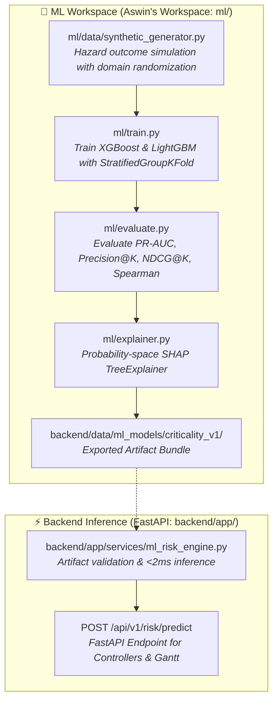

# SIH PS 26027: AI / ML Module Specification (Aswin's Scope)
## Stage 2: AI Risk & Criticality Scoring Engine ($CI \in [0, 100]$) & Explainable AI (SHAP)

---

## 1. System Overview & Objective

The goal of this module is to replace manual, subjective railway maintenance prioritization with an objective, data-driven **Criticality Index ($CI \in [0, 100]$)** using a **Two-Mode Scoring Architecture**:
1. **Mode 1 (Operational Baseline & Fallback — v1):** A transparent, expert-weighted linear scoring formula with deterministic coefficients calibrated to Indian Railways domain guidelines. Used as the comparison baseline and deterministic fallback when ML artifacts are unavailable.
2. **Mode 2 (Planning & Primary ML — v2):** Gradient Boosted Decision Trees (`XGBoost` / `LightGBM`) trained on simulated degradation-failure outcomes via a hazard model, calibrated with isotonic regression, and paired with **SHAP (SHapley Additive exPlanations)** in probability space.

Both modes share identical semantic outputs ($CI \in [0, 100]$), enabling seamless downstream execution in Stage 4 (Clustering) and Stage 5 (OR-Tools CP-SAT).

### Architecture & Workflow



---

## 2. Mathematical Formulation & Feature Specifications

### 2.1 v1 Rule-Based CI (evaluation baseline & deterministic fallback)
$$CI = 0.30 \cdot \text{tgi\_deviation} + 0.25 \cdot \frac{\text{speed\_restriction\_kmh}}{1.2} + 0.20 \cdot \frac{\min(\text{days\_overdue}, 60)}{60} \cdot 100 + 0.15 \cdot \frac{\text{section\_gmt\_density}}{1.5} + \text{severity\_penalty}$$

* **Severity Mapping:** The `severity_penalty` term is strictly driven by the statutory Indian Railways USFD classification:
  * `IMRW` (T1): $+35$
  * `IMR` (T1): $+25$
  * `OBSW` (T2): $+10$
  * `OBS` (T2): $+5$
  * `Good`: $+0$
  Clipped to $[0, 100]$.

### 2.2 Labeling Strategy: Hazard Function with Domain Randomization
Crucially, the machine learning objective is **binary maintenance prioritization** (predicting simulated 30-day track/asset failure: $\text{failure\_30d} \in \{0, 1\}$) driven by a latent non-linear degradation hazard process, **NOT regression onto our own v1 formula**.

Labels are generated via a latent hazard probability:
$$\text{hazard\_prob} = \sigma\left(\text{logit\_base} + \sum_{k} \beta_k f_k + \sum_{i,j} \gamma_{ij} \cdot (\text{interaction}_{ij})\right)$$
where interactions include:
- $\text{usfd\_flaw\_severity} \times \text{section\_gmt\_density}$
- $\text{ohe\_insulator\_wear} \times \text{section\_gmt\_density}$
- $\text{point\_failure\_risk} \times \text{days\_overdue}$

**Domain Randomization:** Coefficients $(\beta, \gamma, \text{logit\_base})$ and latent section regimes are randomized across priors so the model learns general physical degradation relationships rather than memorizing a single fixed formula. Label noise ($2\text{--}5\%$) is injected, producing a realistic 5–15% base positive rate. Latent `hazard_prob` and `section_id` groups are strictly isolated as sidecars and never leaked into training features.

### 2.3 Feature Specifications

| Feature Name | Type | Range / Values | Department | Description |
| :--- | :---: | :---: | :---: | :--- |
| **`tgi_deviation`** | `float` | `0.0` to `100.0` | Track (TMS) | Deviation from standard Track Geometry Index ($100 - \text{TGI}$) across Gauge, Cross-Level, Twist, Longitudinal Level, Alignment, and Curvature. |
| **`speed_restriction_kmh`**| `float` | `0.0` to `120.0` | All | Speed drop delta: $\text{MPS} - v_{\text{TSR}}$ (e.g. $110 - 30 = 80\text{ km/h}$). |
| **`days_overdue`** | `float` | `0.0` to `60.0` | All | Days elapsed past statutory maintenance deadline. |
| **`section_gmt_density`** | `float` | `5.0` to `150.0` | All | Annual Gross Million Tonnes carried by section (traffic density). |
| **`department_code`** | `str` / one-hot | `TRACK`, `SIGNAL`, `TRACTION` | All | Department identifier code (encoded as one-hot dummies). |
| **`usfd_classification`** | `str` / `int` | `Good` (0), `OBS` (1), `OBSW` (2), `IMR` (3), `IMRW` (4) | Track (TMS) | Ultrasonic Flaw Detection category per IRPWM (T1 = IMR/IMRW, T2 = OBS/OBSW). |
| **`point_failure_risk`** | `float` | `0.0` to `100.0` | Signal (SMMS) | S&T Point machine electromechanical locking delay/failure probability. |
| **`ohe_insulator_wear`** | `float` | `0.0` to `100.0` | Traction (TDMS) | OHE contact wire stagger wear & insulator degradation percentage. |

---

## 3. Dedicated Workspace Structure (`ml/`)

All AI/ML development takes place inside the root **`ml/`** directory:

```
ml/
├── config.py                    # Global SEED, BOUNDS, feature lists, USFD enum, v1 weights
├── data/
│   ├── synthetic_generator.py   # Hazard-based synthetic data generator with domain randomization
│   └── ir_defects_dataset.csv   # Generated dataset (train + calibration + test)
├── train.py                     # SGKF cross-validation, XGBoost/LightGBM training, isotonic calibration
├── evaluate.py                  # Evaluation suite (PR-AUC, Precision@K, NDCG@K, Spearman, shift & noise)
├── explainer.py                 # Probability-space SHAP TreeExplainer & reasoning generator
├── reports/
│   └── eval_report.md           # Generated evaluation benchmark markdown report
├── requirements-ml.txt          # Python dependencies for ML (xgboost, lightgbm, shap, etc.)
└── tests/                       # Unit tests (additivity, monotonicity, bounds, fallback, leakage)
```

---

## 4. Aswin's Deliverables & Action Items

### Deliverable 1: Domain-Realistic Dataset Generator (`ml/data/synthetic_generator.py`)
* Model non-linear degradation hazard with domain randomization:
  * **Track (TMS):** TGI decay rate, USFD flaw ordinal impact (`Good=0` to `IMRW=4`), and GMT traffic interaction.
  * **Signal (SMMS):** Point locking latency and overdue interaction.
  * **Traction (TDMS):** OHE contact wire wear and GMT interaction.
* Output `hazard_prob` sidecar and latent `section_id` groups (both strictly excluded from training features).
* Support `--shift` mode for out-of-distribution robustness evaluation.

### Deliverable 2: Model Training & Calibration Pipeline (`ml/train.py`)
* Train monotone-constrained classifiers:
  1. **`xgb.XGBClassifier(objective="binary:logistic", tree_method="hist", max_bin=512, eval_metric="aucpr")`**
  2. **`lightgbm.LGBMClassifier(monotone_constraints=..., monotone_constraints_method="intermediate")`**
* Use `StratifiedGroupKFold(n_splits=5, shuffle=True, random_state=SEED)` grouped by `section_id`.
* Fit `CalibratedClassifierCV(method="isotonic", cv="prefit")` on a dedicated group-disjoint calibration split.
* Build percentile `ci_map.json` mapping calibrated probability to Criticality Index ($CI \in [0, 100]$).
* Export artifact bundle to **`backend/data/ml_models/criticality_v1/`** (`model.json`, `calibrator.joblib`, `schema.json`, `enums.json`, `ci_map.json`, `background.npz`, `model_card.json`).

### Deliverable 3: SHAP Explainability in Probability Space (`ml/explainer.py`)
* Initialize `shap.TreeExplainer(booster, data=background, model_output="probability", feature_perturbation="interventional")`.
* Extract exact additive probability-space attributions satisfying $\text{base\_value} + \sum \phi_i \approx P(\text{failure})$.
* Generate human-readable reasoning strings for controllers.

### Deliverable 4: Binary Prioritization Evaluation (`ml/evaluate.py`)
* Evaluate ranking and classification performance across 5 folds:
  * **PR-AUC** (`average_precision_score`, headline metric)
  * **Precision@{10, 25, 50}**
  * **NDCG@{10, 25, 50}** (using `hazard_prob` as graded relevance)
  * **Spearman $\rho$** (correlation vs latent `hazard_prob`)
  * Mean and worst fold reporting.
* Benchmark against v1 Rule-Based CI ablation.
* Robustness evaluation across covariate shifts (`--shift`) and label noise degradation (0%, 2%, 5%).
* **No Continuous Regression Metrics:** Because the operational objective is binary defect failure prioritization and safe slot allocation under hazard, evaluation strictly tracks classification and ranking metrics rather than continuous regression targets ($R^2$, $\text{RMSE}$, $\text{MAE}$).

#### 4.1 In-Distribution Cross-Validation Benchmark (5-Fold StratifiedGroupKFold by `section_id`)

| Model / Metric | PR-AUC (Mean / Worst) | Precision@10 | Precision@25 | Precision@50 | NDCG@10 | NDCG@25 | NDCG@50 | Spearman ρ |
| :--- | :---: | :---: | :---: | :---: | :---: | :---: | :---: | :---: |
| **XGBoost (Primary)** | **0.2270** / `0.2041` | `26.5%` / `21.9%` | `19.4%` / `15.8%` | `15.5%` / `12.5%` | `0.9045` | `0.9243` | `0.9492` | `0.8905` |
| **LightGBM** | **0.2154** / `0.1807` | `26.8%` / `21.9%` | `19.4%` / `15.0%` | `15.8%` / `13.7%` | `0.8828` | `0.9080` | `0.9358` | `0.8603` |
| **Rule-based v1 (Fallback)** | **0.2060** / `0.1718` | `23.6%` / `18.8%` | `18.5%` / `15.6%` | `15.0%` / `12.0%` | `0.8745` | `0.8765` | `0.9097` | `0.7551` |

> *Note on Graded Relevance:* NDCG@{10,25,50} and Spearman $\rho$ are evaluated against the continuous ground-truth latent `hazard_prob` sidecar.

#### 4.2 Post-Hoc Isotonic Calibration Verification (Dedicated Group-Disjoint Split)

| Decile | Sample Count | Mean Predicted Probability | Observed Failure Rate | Absolute Gap |
| :---: | :---: | :---: | :---: | :---: |
| 1 | 154 | 0.0382 | 0.0260 | 0.0122 |
| 2 | 247 | 0.0518 | 0.0648 | 0.0130 |
| 3 | 64 | 0.0518 | 0.0312 | 0.0206 |
| 4 | 127 | 0.0815 | 0.0709 | 0.0107 |
| 5 | 239 | 0.1240 | 0.1297 | 0.0057 |
| 6 | 104 | 0.1346 | 0.1346 | 0.0000 |
| 7 | 136 | 0.2531 | 0.2574 | 0.0043 |
| 8 | 78 | 0.4177 | 0.4103 | 0.0075 |

#### 4.3 Robustness & Generalization Analysis

##### Covariate Regime-Shift (Heavy-Freight Traffic Shift via `--shift`)
* **Shifted Dataset Base Rate:** `50.6%` (elevated traffic & asset wear)
* **Shifted PR-AUC:** `0.7242`
* **Shifted Precision@25:** `77.7%`
* **Shifted NDCG@25:** `0.9536`
* **Shifted Spearman ρ:** `0.9135`

##### Label-Noise Degradation Curve

| Injected Label Noise | PR-AUC | Precision@25 | Performance Retention |
| :---: | :---: | :---: | :---: |
| **0% (Clean)** | `0.2442` | `20.4%` | `100.0%` |
| **2% Noise** | `0.1515` | `15.0%` | `62.0%` |
| **5% Noise** | `0.2415` | `23.2%` | `98.9%` |

---

## 5. Input & Output Data Contracts (API Integration)

The backend endpoints (`POST /api/v1/risk/predict` and `GET /api/v1/risk/model-info`) and Gantt chart consume the model using this exact contract:

### 5.1 Predict Endpoint: `POST /api/v1/risk/predict`

#### Input Payload:
```json
{
  "request_code": "MR-TRK-104",
  "department": "TRACK",
  "activity_type": "RAIL_RENEWAL_USFD",
  "metadata": {
    "tgi_deviation": 82.5,
    "speed_restriction_kmh": 80.0,
    "days_overdue": 14,
    "section_gmt_density": 45.2,
    "usfd_classification": "IMRW",
    "point_failure_risk": 0.0,
    "ohe_insulator_wear": 0.0
  }
}
```

#### Output Response (`200 OK`):
```json
{
  "request_code": "MR-TRK-104",
  "failure_probability": 0.61,
  "criticality_index": 88.0,
  "model_used": "xgb_isotonic_ci_v1",
  "shap_explanation": {
    "space": "probability",
    "base_value": 0.08,
    "feature_attributions": {
      "USFD rail flaw (IMR)": 0.21,
      "Speed restriction delta (80 km/h)": 0.14,
      "Days overdue (14)": 0.09,
      "Section GMT density (45.2)": 0.06,
      "TGI deviation (82.5)": 0.03
    },
    "human_readable_reasoning": "Base failure rate 8%. USFD IMR flaw +21 pts, 80 km/h TSR +14, 14 days overdue +9, heavy-freight section +6, TGI deviation +3 → 61% simulated 30-day failure probability; CI 88 = riskier than 88% of the current backlog."
  }
}
```

### 5.2 Model Info Endpoint: `GET /api/v1/risk/model-info`

#### Output Response (`200 OK`):
```json
{
  "model_name": "xgb_isotonic_ci_v1",
  "version": "criticality_v1",
  "status": "ready",
  "created_at": "2026-08-28T18:00:00Z",
  "seed": 42,
  "library_versions": {
    "xgboost": "2.1.1",
    "scikit-learn": "1.5.2",
    "shap": "0.46.0"
  },
  "feature_order": [
    "tgi_deviation",
    "speed_restriction_kmh",
    "days_overdue",
    "section_gmt_density",
    "point_failure_risk",
    "ohe_insulator_wear",
    "usfd_flaw_severity",
    "dept_SIGNAL",
    "dept_TRACK",
    "dept_TRACTION"
  ],
  "bounds": {
    "tgi_deviation": [0.0, 100.0],
    "speed_restriction_kmh": [0.0, 120.0],
    "days_overdue": [0.0, 60.0],
    "section_gmt_density": [5.0, 150.0],
    "point_failure_risk": [0.0, 100.0],
    "ohe_insulator_wear": [0.0, 100.0],
    "usfd_flaw_severity": [0.0, 4.0]
  },
  "base_positive_rate": 0.082,
  "cv_splits": 5,
  "cv_grouping": "section_id",
  "metrics": {
    "pr_auc_mean": 0.227,
    "precision_at_25_mean": 0.194,
    "ndcg_at_25_mean": 0.924,
    "spearman_rho_mean": 0.891
  },
  "disclaimer": "Trained on simulated labels only. No real IR failure data was used. Absolute CI values are not field probabilities until recalibrated on real labeled outcomes in a CRIS pilot.",
  "artifact_sha256": "4b6f12...e389"
}
```

---

## 6. How to Run & Verify

1. **Install ML dependencies using `uv`:**
   ```bash
   uv pip install -r ml/requirements-ml.txt
   ```

2. **Generate synthetic dataset:**
   ```bash
   uv run python ml/data/synthetic_generator.py
   ```

3. **Train and calibrate models:**
   ```bash
   uv run python ml/train.py
   ```

4. **Evaluate performance benchmarks:**
   ```bash
   uv run python ml/evaluate.py
   ```

5. **Self-test probability-space SHAP explainer:**
   ```bash
   uv run python ml/explainer.py --selftest
   ```

6. **Verify integration with backend test suite:**
   ```bash
   cd backend
   uv run pytest tests/test_ml_risk_engine.py -v
   ```
