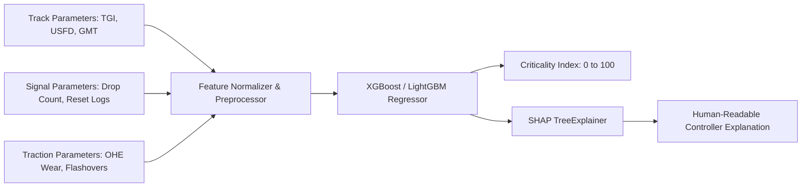

# SIH PS 26027: AI / ML Module Specification (Aswin's Scope)
## Stage 2: AI Risk & Criticality Scoring Engine ($CI \in [0, 100]$) & Explainable AI (SHAP)

---

## 1. Overview & Objective

The goal of this module is to replace manual, subjective maintenance prioritization with a deterministic, data-driven **Criticality Index ($CI \in [0, 100]$)** using Gradient Boosted Decision Trees (`XGBoost` / `LightGBM`) paired with **SHAP Explainable AI (XAI)**.



---

## 2. Mathematical Formulation & Feature Set

### 2.1 Criticality Index Formula
$$CI = w_1 \cdot \text{TGI\_Deviation} + w_2 \cdot \Delta v_{\text{SpeedRestriction}} + w_3 \cdot \text{DaysOverdue} + w_4 \cdot \text{SectionGMTDensity} + \text{DefectSeverityPenalty}$$

Where:
* **TGI Deviation ($\text{TGI\_Deviation}$):** Track Geometry Index deviation combining Gauge, Cross-Level, Twist, Alignment, and Versine.
* **Speed Restriction Penalty ($\Delta v_{\text{SpeedRestriction}}$):** Difference between Max Permissible Speed (MPS) and current Temporary Speed Restriction (TSR) enforced (e.g. $110\text{ km/h} - 30\text{ km/h} = 80\text{ km/h}$ delta).
* **Days Overdue ($\text{DaysOverdue}$):** Number of days elapsed past the statutory inspection/maintenance due date.
* **Section GMT Density ($\text{SectionGMTDensity}$):** Annual Gross Million Tonnes carried by the section (higher density = higher risk).
* **Defect Severity Penalty:** Categorical boost for severe flaws (e.g. `USFD_IMMEDIATE_REMOVAL`, `POINT_LOCK_FAILURE`, `OHE_PARTING_RISK`).

---

## 3. Core Deliverables for Aswin

### Deliverable 1: ML Model Training & Feature Pipeline (`ml/criticality_model.py`)
1. Prepare training pipeline utilizing `xgboost` or `lightgbm`.
2. Normalize inputs to produce continuous outputs bounded in $[0, 100]$.
3. Save trained model artifacts (`model.joblib` or `model.json`).

### Deliverable 2: SHAP Explainability Generator (`ml/explainer.py`)
1. Implement `shap.TreeExplainer` on the trained model.
2. Generate top 3 feature contributors for any maintenance request.
3. Produce human-readable text output for Section Controllers:
   * *Example:* `"Job #MR-TRK-001 rated 88/100: USFD Severe flaw (+42 pts), 14 days overdue (+26 pts), high GMT density (+20 pts)."`

### Deliverable 3: AI Inference Service / Function for Backend Core Integration
Provide a Python service/module that Aadith & Santhosh can call directly within the backend:
```python
def calculate_criticality_score(request_data: dict) -> tuple[float, str]:
    """
    Args:
        request_data: dictionary containing TGI, USFD flaw type, overdue days, GMT, etc.
    Returns:
        (criticality_score: float [0-100], explanation: str)
    """
    ...
```

---

## 4. Input & Output Data Contracts

### Input Schema (Features for Scoring)
```json
{
  "request_code": "MR-TRK-104",
  "department": "TRACK",
  "activity_type": "Rail Grinding",
  "tgi_index": 72.4,
  "tgi_standard": 100.0,
  "usfd_flaw_severity": "HIGH",
  "current_tsr_kmh": 30,
  "section_mps_kmh": 110,
  "days_overdue": 14,
  "annual_gmt": 45.2,
  "failure_history_count_90d": 3
}
```

### Output Schema (Scoring Result)
```json
{
  "request_code": "MR-TRK-104",
  "criticality_score": 84.6,
  "risk_category": "CRITICAL",
  "shap_top_factors": [
    {"factor": "Speed Restriction Delta (80 km/h)", "impact": "+34.2"},
    {"factor": "TGI Index Degradation (27.6 pts)", "impact": "+28.1"},
    {"factor": "14 Days Overdue", "impact": "+22.3"}
  ],
  "human_explanation": "Critical priority: Speed restriction penalty is severe (80 km/h drop) and TGI deviation breached safety thresholds on a 45.2 GMT track."
}
```
