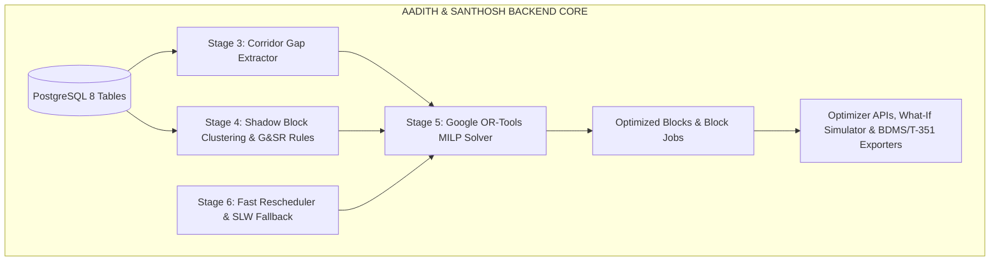

# SIH PS 26027: Backend Core Technical Specification (Aadith & Santhosh's Scope)
## Core Data Engine, Algorithms, Solvers & Optimization APIs

---

## 1. Scope & Ownership

Aadith and Santhosh are responsible for the **algorithmic backbone and computational engine** of RailBlock:
1. **Data Architecture & Schema Persistence:** PostgreSQL database, async SQLAlchemy 2.0 ORM, Alembic migrations, and real Indian Railways data seed pipelines.
2. **Corridor Gap & Headway Extractor (Stage 3):** Train occupancy interval computation and downtime slot extraction.
3. **Multi-Department Shadow Block Clustering (Stage 4):** Spatial clustering ($\le 10\text{ km}$), Traction FP/SP power boundary isolation matching, and G&SR safety conflict validation.
4. **Constraint Optimization Engine (Stage 5):** Google OR-Tools Mixed-Integer Linear Programming (MILP) solver assigning joint maintenance blocks to available track windows.
5. **Real-Time Fast Rescheduling & SLW Fallback (Stage 6):** Greedy heuristic solver ($< 30\text{ seconds}$) for live train delays $> 20\text{ min}$ and Single Line Working (SLW) fallback under G&SR Ch 5/15.
6. **Backend Optimization & Export APIs:** Optimizer execution endpoints, What-If simulation calculation service, and CRIS BDMS / Form T/351 payload exporters.

---

## 2. Detailed Technical Breakdown & Implementation Plan

### Module 1: Corridor Gap & Capacity Extractor (Stage 3)
* **File:** `backend/app/services/gap_extractor.py`
* **Algorithm:**
  1. For a given `section_id` and `target_date`, fetch all active `train_movements`.
  2. Order movements chronologically by `departure_time` and `arrival_time`.
  3. Apply mandatory Indian Railways safety buffer: $\ge 15\text{ minutes}$ before and after each train passage.
  4. Identify all continuous idle track intervals where $\Delta T \ge \text{Min Block Duration}$ (e.g. 60 minutes).
  5. Flag proximity to high-priority trains (Rajdhani / Vande Bharat / Superfast).

---

### Module 2: Multi-Department "Shadow Block" Clustering & G&SR Conflict Engine (Stage 4)
* **File:** `backend/app/services/clustering.py`
* **Algorithm & Rules:**
  1. **Spatial Grouping:** Cluster pending maintenance requests located within the same section / station boundary ($\le 10\text{ km}$).
  2. **Traction (TDMS) Power Isolation Matcher:** Map OHE power demands to Substation Feeding Posts (FP) / Sectioning Posts (SP) (40–80 km spans) ensuring power cuts do not disable adjacent running lines.
  3. **G&SR Safety Conflict Matrix Evaluator:** Query `compatibility_rules` to ensure candidate grouped activities are safe to execute concurrently (e.g. Disallow machine tamping while point machine testing is ongoing on the same chainage).
  4. Bundle mutually compatible, spatially co-located requests into candidate **Joint Shadow Blocks**.

---

### Module 3: Google OR-Tools Constraint Optimization Engine (Stage 5)
* **File:** `backend/app/services/optimizer.py`
* **Mathematical Model:**
  * **Decision Variables:**
    * $y_{m,s,t} \in \{0, 1\}$: Block $m$ granted on section $s$ at time $t$.
    * $z_{m_1, m_2} \in \{0, 1\}$: Requests $m_1$ and $m_2$ combined into a Joint Shadow Block.
  * **Objective Function:**
    $$\max \sum_{m} \left( \text{Criticality}(m) \cdot \sum_t y_{m,s,t} \right) + \alpha \cdot \text{ShadowOverlapHours} - \beta \cdot \text{TrainDetentionMinutes}$$
  * **Hard Constraints:**
    * Mutually exclusive occupancy: Train passage vs Block possession ($\sum x + y \le 1$).
    * Minimum continuous duration: Block cannot be fractured below required job duration.
    * High-priority passenger timetable protection.
    * Safety buffers $\ge 15\text{ mins}$.

---

### Module 4: Real-Time Dynamic Rescheduling & SLW Fallback (Stage 6)
* **File:** `backend/app/services/rescheduler.py`
* **Logic:**
  1. Fast greedy heuristic re-solver: When a train delay $> 20\text{ minutes}$ occurs, recompute the affected block schedule in $< 30\text{ seconds}$.
  2. **Burst Block / Breakdown Protocol:** If a tamping machine breaks down or a block overruns, trigger the Single Line Working (SLW) state machine (G&SR Ch 5/15) to route priority trains over the parallel line.

---

### Module 5: Optimizer & Export API Endpoints (Stage 7 Backend)
* **Files:** `backend/app/api/optimizer.py`, `backend/app/api/blocks.py`
* **Endpoints:**
  * `POST /api/v1/optimizer/run`: Executes Stage 3 $\to$ Stage 4 $\to$ Stage 5 solver pipeline and saves scheduled blocks into the database.
  * `POST /api/v1/optimizer/simulate`: Computes detention vs risk for hypothetical time shifts without persisting to the database.
  * `GET /api/v1/blocks/{id}/export-bdms`: Returns CRIS BDMS-compliant JSON payload.
  * `GET /api/v1/blocks/{id}/t351-notice`: Returns Form T/351 statutory disconnection payload with Private Number validation tokens.

---

## 3. Progress Scorecard for Aadith & Santhosh

| Module | Weight | Status | % Done |
| :--- | :---: | :---: | :---: |
| **1. Data Architecture, ORM Models & Seeds** | 20% | ✅ Complete | **90%** |
| **2. CRUD API Endpoints & DB Repositories** | 15% | ✅ Complete | **85%** |
| **3. Corridor Gap & Headway Extractor** | 15% | ✅ Complete | **100%** |
| **4. Shadow Block Clustering & G&SR Conflict Engine** | 15% | ✅ Complete | **100%** |
| **5. Google OR-Tools MILP Solver** | 20% | ✅ Complete | **100%** |
| **6. Real-Time Fast Rescheduler & SLW Fallback** | 10% | ✅ Complete | **100%** |
| **7. Optimizer, What-If & Statutory Export APIs** | 5% | ⏳ To Implement | **10%** |
| **TOTAL BACKEND CORE COMPLETION** | **100%** | | **~92%** |

