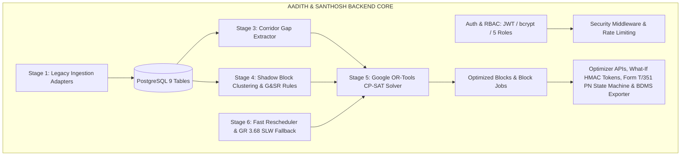

# SIH PS 26027: Backend Core Technical Specification (Aadith & Santhosh's Scope)
## Core Data Engine, Algorithms, Solvers & Optimization APIs

---

## 1. Scope & Ownership

Aadith and Santhosh are responsible for the **algorithmic backbone, computational services, security layer, and API infrastructure** of RailBlock:
1. **Data Architecture & Schema Persistence:** PostgreSQL database (9 tables), async SQLAlchemy 2.0 ORM, Alembic migrations, and Synthetic Seed Sandbox calibrated to published Indian Railways statistics.
2. **Authentication, Security & Middleware:** OAuth2 Password Bearer JWT tokens, bcrypt password hashing, 4+1-tier Role-Based Access Control (`ADMIN`, `SECTION_CONTROLLER`, `STATION_MASTER`, `DEPARTMENT_ENGINEER`, `DIVISIONAL_AUTHORITY`), `slowapi` rate limiting (120 req/min), `structlog` JSON structured logging, and OWASP security headers.
3. **Legacy Ingestion Adapters (Stage 1):** Read-Only Edge Gateway adapters for TMS (Track flaws/TGI with Good/IMR/IMRW/OBS/OBSW classification and Curvature), SMMS (Point machines), and TDMS (OHE wire wear).
4. **Corridor Gap & Headway Extractor (Stage 3):** Train occupancy interval computation, multi-day rolling midnight stitching, and downtime slot extraction ($\ge 60\text{ min}$) with statutory $\ge 15\text{ min}$ safety headways.
5. **Multi-Department Shadow Block Clustering (Stage 4):** Spatial clustering ($\le 10\text{ km}$), Traction FP/SP power boundary isolation matching, G&SR safety conflict validation, and primary anchor selection with internal flexible shadow offsets.
6. **Constraint Optimization Engine (Stage 5):** Google OR-Tools Constraint Programming (CP-SAT) solver enforcing Tier-1 VIP zero-detention hard constraints, regional heavy machine fleet capacity limits, and multi-horizon weekly/monthly batch triggers.
7. **Real-Time Fast Rescheduling & SLW Fallback (Stage 6):** Sub-millisecond greedy heuristic solver for train delays $> 20\text{ min}$, and Temporary Single Line Working (TSLW) fallback under GR 3.68, zonal SR Chapter 4 (SR 4.42, SR 4.09), and zonal SR Chapter 15 with Form T/D 602 support sheets.
8. **Statutory Exporters, What-If Sandbox & APIs (Stage 7):** In-memory What-If scenario calculations with signed HMAC-SHA256 commit tokens, Form T/351 Private Number exchange state machine, and CRIS BDMS JSON draft block exporter.

---

## 2. Detailed Technical Breakdown & Implementation Guide

### Module 0: Authentication, Security & Middleware Architecture
* **Files:** `backend/app/core/security.py`, `backend/app/core/permissions.py`, `backend/app/api/auth.py`, `backend/app/main.py`
* **Implementation Details:**
  1. **Password Hashing:** Uses `passlib[bcrypt]` with automatic salting and 72-byte truncation protection.
  2. **JWT Token Engine:** Issues signed `HS256` Bearer tokens with 480-minute TTL containing `sub`, `role`, `user_id`, and `email`.
  3. **Role-Based Access Control (4+1-Tier RBAC):**
     * `RoleEnum`: `ADMIN`, `SECTION_CONTROLLER`, `STATION_MASTER`, `DEPARTMENT_ENGINEER`, `DIVISIONAL_AUTHORITY` (for traffic blocks > 4 hrs and non-interlocking works > 3 days per Railway Board letter dated 16.06.2022).
     * `RequireRole(allowed_roles)` dependency enforcing role authorization with `ADMIN` superuser bypass.
  4. **Production Middleware:**
     * `slowapi.Limiter`: Enforces `120 requests/minute` per remote IP.
     * `structlog`: Structured JSON logging with ISO-8601 timestamps and unhandled exception tracing.
     * `SecurityHeadersMiddleware`: Injects `X-Content-Type-Options: nosniff`, `X-Frame-Options: DENY`, `X-XSS-Protection: 1; mode=block`.

---

### Module 1: Legacy Data System Ingestion Adapters (Stage 1)
* **Files:** `backend/app/services/adapters.py`, `backend/app/api/ingestion.py`
* **Adapters & Endpoints:**
  1. **`TMSAdapter` (`POST /api/v1/ingest/tms`):** Ingests USFD rail flaw classifications per IRPWM standard (**Good / IMR / IMRW / OBS / OBSW**, tabulated as T1 = IMR/IMRW, T2 = OBS/OBSW), Track Geometry Index (TGI - combining Gauge, Cross-Level, Twist, Longitudinal Level, Alignment, and Curvature), and chainage km markers.
  2. **`SMMSAdapter` (`POST /api/v1/ingest/smms`):** Ingests S&T point machine failure risk score, station code, and asset ID.
  3. **`TDMSAdapter` (`POST /api/v1/ingest/tdms`):** Ingests OHE contact wire wear percentage, Substation Feeding Post (FP) identifier, and power isolation flags.

---

### Module 2: Corridor Gap & Capacity Extractor (Stage 3)
* **File:** `backend/app/services/gap_extractor.py`
* **Algorithm:**
  1. For a given `section_id` and `target_date`, fetch all timetabled `train_movements`.
  2. **Rolling Midnight Stitching:** Evaluates multi-day windows ($[-1, \text{horizon}+1]$) across 23:59 to 00:00 without day boundary truncation.
  3. **Statutory Safety Headway:** Enforces mandatory $\ge 15\text{ minutes}$ safety buffers before train entry and after train clearance.
  4. **Duration Filtering:** Extracts continuous unoccupied intervals where $\Delta T \ge \text{Minimum Block Duration}$ (default: 60 minutes).
  5. **Directional Segregation:** Categorizes gaps by line direction (`UP`, `DOWN`, `BOTH`, `SINGLE`) with train parity heuristics (even=UP, odd=DOWN).
  6. **VIP Proximity Detection:** Flags proximity to Tier 1 express runs (Rajdhani, Vande Bharat, Shatabdi, Tejas, Duronto, Gatimaan).

---

### Module 3: Multi-Department "Shadow Block" Clustering & G&SR Conflict Engine (Stage 4)
* **File:** `backend/app/services/clustering.py`
* **Algorithm & Rules:**
  1. **Spatial Grouping:** Clusters pending maintenance requests located within the same section boundary ($\le 10\text{ km}$).
  2. **Traction (TDMS) Power Isolation Matcher:** Maps OHE power demands to Substation Feeding Posts (FP) / Sectioning Posts (SP) (40–80 km spans), ensuring local power blocks do not de-energize adjacent running lines.
  3. **G&SR Safety Conflict Matrix Evaluator:** 24 built-in standard safety rules plus dynamic database rules in `compatibility_rules`, strictly disallowing incompatible task pairs (e.g. Track Tamping Machine operation is prohibited while Point Machine Testing is ongoing on the same chainage).
  4. **Primary Anchor & Flexible Internal Offsets:** Designates the longest/highest-risk job as the Primary Block anchor and schedules secondary Shadow Activities with valid internal start/end offsets.
  5. **Labor Hours Recovery:** Computes `shadow_overlap_hours` (work hours saved through concurrent possession).

---

### Module 4: Google OR-Tools Constraint Optimization Engine (Stage 5)
* **File:** `backend/app/services/optimizer.py`
* **Mathematical Model:**
  * **Decision Variables:**
    * $y_{m, g} \in \{0, 1\}$: 1 if Candidate Joint Block $m$ is assigned to Corridor Gap $g$, 0 otherwise.
  * **Objective Function:**
    $$\max \sum_{m, g} y_{m, g} \cdot \left[ \text{CriticalityScore}(m) + \alpha \cdot \text{ShadowOverlapHours}(m) - \beta \cdot \text{TrainDetentionMinutes}(m, g) \right]$$
  * **Hard Constraints:**
    1. **Corridor Duration Bound:** Block duration cannot exceed gap duration ($D_m \le T_g$).
    2. **Gap Exclusivity:** At most one major block per section per gap window ($\sum_m y_{m, g} \le 1$).
    3. **Request Uniqueness:** Each maintenance request can be scheduled at most once across all selected blocks ($\sum_{m \in \mathcal{M}_r} \sum_g y_{m, g} \le 1$).
    4. **Tier 1 VIP Passenger Protection:** Hard zero-detention constraint ($\text{Detention}(m, g) = 0$ for all gaps adjacent to Rajdhani, Vande Bharat, Shatabdi, Tejas, Duronto, Gatimaan).
    5. **Machine Resource Capacity Limits:** Total heavy machines (Tamping Machines, Tower Wagons, BCMs) allocated across all concurrent section blocks cannot exceed active regional fleet capacity:
       $$\sum_{m \in \mathcal{M}_{\text{res}}} \sum_{g \in \mathcal{G}_t} y_{m, g} \le \text{Capacity}(\text{res}), \quad \forall \text{res} \in \mathcal{R}, \forall t$$
  * **Multi-Horizon Support:** Re-optimizes rolling 7-day weekly base schedules and 30-day monthly corridor maintenance plans using the same CP-SAT solver formulation.

---

### Module 5: Real-Time Dynamic Rescheduling & G&SR SLW Fallback (Stage 6)
* **File:** `backend/app/services/rescheduler.py`
* **Logic:**
  1. **Minor Delays ($\le 20\text{ min}$):** Absorbed directly into the $\ge 15\text{ min}$ statutory safety buffers.
  2. **Major Delays ($> 20\text{ min}$):** Fast greedy heuristic re-solver shifts block start/end times in $< 1\text{ ms}$ without global CP-SAT re-solving.
  3. **Block Overrun Disruption ($+15\text{ min}$ overrun with queued trains):**
     * Triggers a **Temporary Single Line Working (TSLW) advisory** for the adjacent double line, per **GR 3.68** (Regulations for Single Line Working on Double Line during total interruption of communication), zonal **Subsidiary Rules Chapter 4** (SR 4.42 — SLW speed restrictions; SR 4.09 — clamping/padlocking of points), and zonal **SR Chapter 15** procedures. Written authority is issued via **Form T/D 602** (Line Clear Ticket + Authority to Pass Signals at 'ON' + Caution Order).
     * Enforces statutory caution-order speed restrictions:
       * **First / Pilot Train:** 25 km/h (caution order speed restriction)
       * **Facing Points / Crossovers:** 15 km/h
       * **Subsequent Running Trains:** Booked speed (a 40 km/h cap applies only to wrong-direction working on automatic block sections per TSL procedure)
     * Generates a draft Caution Order + Form T/D 602 support sheet and Section Controller control-phone script; freight regulation (holding trains in sidings) is presented as controller decision support.

---

### Module 6: In-Memory What-If Simulation, Form T/351 State Machine & Exporters (Stage 7)
* **Files:** `backend/app/api/optimizer.py`, `backend/app/api/blocks.py`
* **Features:**
  1. **In-Memory What-If Simulation:** `POST /api/v1/optimizer/simulate` computes time-shift impacts in-memory and returns a cryptographically signed **HMAC-SHA256 Commit Token** with a 15-minute expiration window.
  2. **Token Commit Action:** `POST /api/v1/optimizer/commit-simulation` verifies the HMAC token signature and persists the simulated schedule directly to PostgreSQL without draft DB pollution.
  3. **Statutory Form T/351 State Machine:**
     $$\text{PROPOSED} \longrightarrow \text{APPROVED} \longrightarrow \text{ACTIVE (with Disconnection PN)} \longrightarrow \text{COMPLETED (with Reconnection PN \& TSR)}$$
  4. **CRIS BDMS JSON Exporter:** `GET /api/v1/blocks/{id}/export-bdms` outputs standard CRIS BDMS draft block possession payloads.
  5. **Form T/351 Notice Exporter:** `GET /api/v1/blocks/{id}/t351-notice` outputs official Disconnection Notice records with Private Number validation tokens.

---

### Module 7: Complete REST & WebSocket API Endpoints Catalog

All endpoints are hosted under prefix `/api/v1`:

| Router Module | Method | Endpoint Path | Description | Access / Role |
| :--- | :---: | :--- | :--- | :--- |
| **Authentication** | `POST` | `/api/v1/auth/login` | Authenticate credentials & issue JWT token | Public |
| | `GET` | `/api/v1/auth/me` | Return authenticated user identity & role | Authenticated |
| | `POST` | `/api/v1/auth/seed-users` | Seed default demo accounts | Admin |
| **Legacy Ingestion**| `POST` | `/api/v1/ingest/tms` | Ingest Track defect from TMS feed | Engineer / Controller |
| | `POST` | `/api/v1/ingest/smms` | Ingest Signal defect from SMMS feed | Engineer / Controller |
| | `POST` | `/api/v1/ingest/tdms` | Ingest Traction defect from TDMS feed | Engineer / Controller |
| **AI Risk Engine** | `POST` | `/api/v1/risk/predict` | Predict Criticality Index ($CI \in [0, 100]$) + SHAP | Authenticated |
| | `GET` | `/api/v1/risk/model-info` | Feature list & metadata for Stage 2 ML model | Authenticated |
| **Sections** | `POST` | `/api/v1/sections` | Create new railway section | Admin |
| | `GET` | `/api/v1/sections` | List sections with zone/division filters | Authenticated |
| | `GET` | `/api/v1/sections/{id}` | Get section details by UUID | Authenticated |
| | `PUT` | `/api/v1/sections/{id}` | Update section attributes | Admin |
| | `DELETE` | `/api/v1/sections/{id}` | Delete section | Admin |
| **Trains** | `POST` | `/api/v1/trains` | Register train service | Admin / Controller |
| | `GET` | `/api/v1/trains` | List trains with priority filters | Authenticated |
| | `GET` | `/api/v1/trains/{id}` | Get train details by UUID | Authenticated |
| | `PUT` | `/api/v1/trains/{id}` | Update train service | Admin / Controller |
| | `DELETE` | `/api/v1/trains/{id}` | Delete train service | Admin |
| **Train Movements**| `POST` | `/api/v1/train-movements` | Add timetable section movement | Controller |
| | `GET` | `/api/v1/train-movements` | List movements with section/day filters | Authenticated |
| | `GET` | `/api/v1/train-movements/{id}`| Get movement details | Authenticated |
| | `PUT` | `/api/v1/train-movements/{id}`| Update movement timing | Controller |
| | `DELETE` | `/api/v1/train-movements/{id}`| Delete movement | Controller |
| **Maintenance** | `POST` | `/api/v1/maintenance` | Create maintenance request | Engineer |
| | `GET` | `/api/v1/maintenance` | List requests with status/dept filters | Authenticated |
| | `GET` | `/api/v1/maintenance/{id}` | Get request details | Authenticated |
| | `PUT` | `/api/v1/maintenance/{id}` | Update request | Engineer |
| | `DELETE` | `/api/v1/maintenance/{id}` | Delete request | Engineer |
| **Resources** | `POST` | `/api/v1/resources` | Register machine / maintenance gang | Admin / Engineer |
| | `GET` | `/api/v1/resources` | List machine resources | Authenticated |
| | `GET` | `/api/v1/resources/{id}` | Get resource details | Authenticated |
| | `PUT` | `/api/v1/resources/{id}` | Update resource capacity/availability | Admin / Engineer |
| | `DELETE` | `/api/v1/resources/{id}` | Delete resource | Admin |
| **Compatibility** | `POST` | `/api/v1/compatibility` | Add G&SR activity compatibility rule | Admin |
| | `GET` | `/api/v1/compatibility` | List compatibility rules | Authenticated |
| | `DELETE` | `/api/v1/compatibility/{id}` | Delete rule | Admin |
| **Blocks** | `GET` | `/api/v1/blocks` | List scheduled blocks | Authenticated |
| | `GET` | `/api/v1/blocks/{id}` | Get block details with included jobs | Authenticated |
| | `POST` | `/api/v1/blocks/{id}/transition`| Form T/351 Private Number state transition | Station Master |
| | `GET` | `/api/v1/blocks/{id}/export-bdms`| Export CRIS BDMS JSON draft block format | Controller |
| | `GET` | `/api/v1/blocks/{id}/t351-notice`| Export Form T/351 Disconnection Notice payload | Station Master |
| **Optimizer** | `POST` | `/api/v1/optimizer/run` | Execute Stages 3 $\to$ 4 $\to$ 5 solver & persist | Controller |
| | `POST` | `/api/v1/optimizer/simulate` | In-memory What-If simulation with HMAC token | Controller |
| | `POST` | `/api/v1/optimizer/commit-simulation`| Commit simulated schedule using HMAC token | Controller |
| | `POST` | `/api/v1/optimizer/reschedule`| Real-time fast rescheduling & SLW fallback | Controller |
| **Live Telemetry** | `WS` | `/api/v1/events/ws/telemetry` | WebSocket live train delay & SLW broadcast | Authenticated |
| **Health Checks** | `GET` | `/` | Root API metadata & Swagger docs link | Public |
| | `GET` | `/health` | Live PostgreSQL connectivity check | Public |

---

## 3. Progress Scorecard for Aadith & Santhosh

| Module | Weight | Status | % Done |
| :--- | :---: | :---: | :---: |
| **1. Data Architecture, ORM Models (9 Tables) & Seeds** | 15% | ✅ Complete | **100%** |
| **2. Authentication, RBAC (4+1 Tier) & Security Middleware** | 10% | ✅ Complete | **100%** |
| **3. Legacy Ingestion Adapters & APIs** | 10% | ✅ Complete | **100%** |
| **4. Corridor Gap & Headway Extractor (Stage 3)** | 15% | ✅ Complete | **100%** |
| **5. Shadow Block Clustering & G&SR Conflict Engine (Stage 4)** | 15% | ✅ Complete | **100%** |
| **6. Google OR-Tools CP-SAT Solver (Stage 5)** | 15% | ✅ Complete | **100%** |
| **7. Real-Time Fast Rescheduler & GR 3.68 SLW Fallback (Stage 6)** | 10% | ✅ Complete | **100%** |
| **8. Optimizer, What-If HMAC & Statutory Export APIs (Stage 7)** | 10% | ✅ Complete | **100%** |
| **TOTAL BACKEND CORE COMPLETION** | **100%** | ✅ **COMPLETE** | **100%** |
